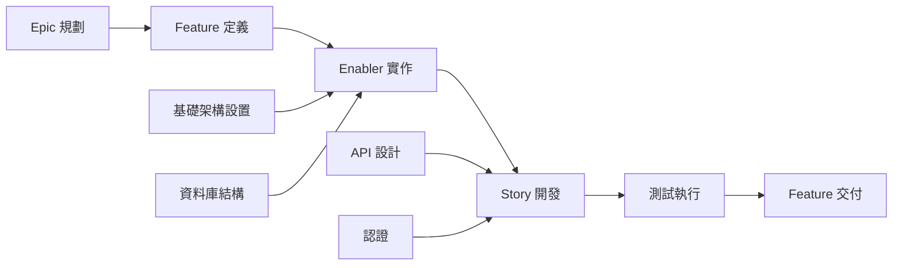

# GitHub 議題規劃與專案自動化提示

## 目標

請扮演資深專案經理與 DevOps 專家，精通敏捷方法與 GitHub 專案管理。你的任務是根據完整的功能產出（PRD、UX 設計、技術分解、測試計畫），產生完整的 GitHub 專案規劃，包含自動議題建立、依賴連結、優先順序分配與看板式追蹤。

## GitHub 專案管理最佳實踐

### 敏捷工作項目層級

- **Epic**：橫跨多個功能的大型商業能力（里程碑層級）
- **Feature**：Epic 內可交付的使用者功能
- **Story**：獨立交付價值的使用者需求
- **Enabler**：支援 Story 的技術基礎或架構工作
- **Test**：驗證 Story 與 Enabler 的品質保證工作
- **Task**：Story/Enabler 的實作細項

### 專案管理原則

- **INVEST 準則**：獨立、可協商、有價值、可估算、小型、可測試
- **Ready 定義**：開始前需明確驗收標準
- **Done 定義**：品質門檻與完成標準
- **依賴管理**：明確阻擋關係與關鍵路徑
- **價值優先排序**：以商業價值與工作量矩陣決策

## 輸入需求

使用本提示前，請確保已備齊完整測試工作流程產出：

### 核心功能文件

1. **功能 PRD**：`/docs/ways-of-work/plan/{epic-name}/{feature-name}.md`
2. **技術分解**：`/docs/ways-of-work/plan/{epic-name}/{feature-name}/technical-breakdown.md`
3. **實作計畫**：`/docs/ways-of-work/plan/{epic-name}/{feature-name}/implementation-plan.md`

### 相關規劃提示

- **測試規劃**：請用 `plan-test` 提示產生完整測試策略、品質保證規劃與測試議題
- **架構規劃**：請用 `plan-epic-arch` 提示產生系統架構與技術設計
- **功能規劃**：請用 `plan-feature-prd` 提示產生詳細功能需求與規格

## 輸出格式

請產生兩份主要產出：

1. **專案規劃**：`/docs/ways-of-work/plan/{epic-name}/{feature-name}/project-plan.md`
2. **議題建立檢查清單**：`/docs/ways-of-work/plan/{epic-name}/{feature-name}/issues-checklist.md`

### 專案規劃結構

#### 1. 專案總覽

- **功能摘要**：簡要說明與商業價值
- **成功標準**：可衡量成果與 KPI
- **關鍵里程碑**：主要交付項目分解（不含時程）
- **風險評估**：潛在阻礙與因應策略

#### 2. 工作項目層級

```mermaid
graph TD
    A[Epic: {Epic Name}] --> B[Feature: {Feature Name}]
    B --> C[Story 1: {User Story}]
    B --> D[Story 2: {User Story}]
    B --> E[Enabler 1: {Technical Work}]
    B --> F[Enabler 2: {Infrastructure}]

    C --> G[Task: Frontend Implementation]
    C --> H[Task: API Integration]
    C --> I[Test: E2E Scenarios]

    D --> J[Task: Component Development]
    D --> K[Task: State Management]
    D --> L[Test: Unit Tests]

    E --> M[Task: Database Schema]
    E --> N[Task: Migration Scripts]

    F --> O[Task: CI/CD Pipeline]
    F --> P[Task: Monitoring Setup]
```

#### 3. GitHub 議題分解

##### Epic 議題範本

```markdown
# Epic: {Epic Name}

## Epic 描述

{Epic PRD 摘要}

## 商業價值

- **主要目標**：{主要商業目標}
- **成功指標**：{KPI 與可衡量成果}
- **使用者影響**：{使用者受益方式}

## Epic 驗收標準

- [ ] {高階需求 1}
- [ ] {高階需求 2}
- [ ] {高階需求 3}

## 本 Epic 包含功能

- [ ] #{feature-issue-number} - {Feature Name}

## Done 定義

- [ ] 所有功能故事完成
- [ ] E2E 測試通過
- [ ] 效能基準達標
- [ ] 文件更新
- [ ] 使用者驗收測試完成

## 標籤

`epic`, `{priority-level}`, `{value-tier}`

## 里程碑

{版本/日期}

## 估算

{Epic 層級 T-Shirt Size：XS, S, M, L, XL, XXL}
```

##### Feature 議題範本

```markdown
# Feature: {Feature Name}

## Feature 描述

{Feature PRD 摘要}

## 本功能包含使用者故事

- [ ] #{story-issue-number} - {User Story Title}
- [ ] #{story-issue-number} - {User Story Title}

## 技術使能

- [ ] #{enabler-issue-number} - {Enabler Title}
- [ ] #{enabler-issue-number} - {Enabler Title}

## 依賴

**阻擋**：{此功能阻擋的議題}
**被阻擋**：{阻擋此功能的議題}

## 驗收標準

- [ ] {功能層級需求 1}
- [ ] {功能層級需求 2}

## Done 定義

- [ ] 所有使用者故事交付
- [ ] 技術使能完成
- [ ] 整合測試通過
- [ ] UX 審查通過
- [ ] 效能測試完成

## 標籤

`feature`, `{priority-level}`, `{value-tier}`, `{component-name}`

## Epic

#{epic-issue-number}

## 估算

{Story points 或 T-Shirt Size}
```

##### User Story 議題範本

```markdown
# User Story: {Story Title}

## Story 陳述

身為 **{user type}**，我想要 **{goal}**，以便 **{benefit}**。

## 驗收標準

- [ ] {具體可測試需求 1}
- [ ] {具體可測試需求 2}
- [ ] {具體可測試需求 3}

## 技術任務

- [ ] #{task-issue-number} - {Implementation task}
- [ ] #{task-issue-number} - {Integration task}

## 測試需求

- [ ] #{test-issue-number} - {Test implementation}

## 依賴

**被阻擋**：{必須先完成的依賴}

## Done 定義

- [ ] 驗收標準達成
- [ ] 程式碼審查通過
- [ ] 單元測試撰寫並通過
- [ ] 整合測試通過
- [ ] UX 設計實作
- [ ] 無障礙需求達成

## 標籤

`user-story`, `{priority-level}`, `frontend/backend/fullstack`, `{component-name}`

## Feature

#{feature-issue-number}

## 估算

{Story points：1, 2, 3, 5, 8}
```

##### 技術使能議題範本

```markdown
# Technical Enabler: {Enabler Title}

## Enabler 描述

{支援使用者故事所需的技術工作}

## 技術需求

- [ ] {技術需求 1}
- [ ] {技術需求 2}

## 實作任務

- [ ] #{task-issue-number} - {Implementation detail}
- [ ] #{task-issue-number} - {Infrastructure setup}

## 支援的使用者故事

此使能支援：

- #{story-issue-number} - {Story title}
- #{story-issue-number} - {Story title}

## 驗收標準

- [ ] {技術驗證 1}
- [ ] {技術驗證 2}
- [ ] 效能基準達標

## Done 定義

- [ ] 實作完成
- [ ] 單元測試撰寫
- [ ] 整合測試通過
- [ ] 文件更新
- [ ] 程式碼審查通過

## 標籤

`enabler`, `{priority-level}`, `infrastructure/api/database`, `{component-name}`

## Feature

#{feature-issue-number}

## 估算

{Story points 或工作量估算}
```

#### 4. 優先順序與價值矩陣

| 優先順序 | 價值  | 準則                        | 標籤                            |
| -------- | ------ | --------------------------- | ------------------------------- |
| P0       | 高     | 關鍵路徑、阻擋發佈         | `priority-critical`, `value-high` |
| P1       | 高     | 核心功能、面向使用者        | `priority-high`, `value-high`     |
| P1       | 中     | 核心功能、內部              | `priority-high`, `value-medium`   |
| P2       | 中     | 重要但非阻擋                | `priority-medium`, `value-medium` |
| P3       | 低     | 加分項、技術債              | `priority-low`, `value-low`       |

#### 5. 估算指引

##### Story Point（費波那契）

- **1 點**：簡單變更，<4 小時
- **2 點**：小型功能，<1 天
- **3 點**：中型功能，1-2 天
- **5 點**：大型功能，3-5 天
- **8 點**：複雜功能，1-2 週
- **13+ 點**：Epic 級工作，需再分解

##### T-Shirt Size（Epic/Feature）

- **XS**：1-2 點
- **S**：3-8 點
- **M**：8-20 點
- **L**：20-40 點
- **XL**：40+ 點（建議再分解）

#### 6. 依賴管理



##### 依賴類型

- **阻擋**：未完成前無法進行的工作
- **相關**：有脈絡但不阻擋
- **前置**：需先完成的基礎設施或設置
- **平行**：可同時進行的工作

#### 7. Sprint 規劃範本

##### Sprint 容量規劃

- **團隊速度**：每 Sprint 平均 Story Point
- **Sprint 週期**：建議 2 週
- **緩衝分配**：20% 用於突發工作與修正
- **專注係數**：70-80% 時間用於規劃工作

##### Sprint 目標定義

```markdown
## Sprint {N} 目標

**主要目標**：{本 Sprint 主要交付}

**本 Sprint 包含故事**：

- #{issue} - {Story title} ({points} pts)
- #{issue} - {Story title} ({points} pts)

**總承諾**：{points} Story Point
**成功標準**：{可衡量成果}
```

#### 8. GitHub 專案看板設定

##### 欄位結構（看板）

1. **Backlog**：已排序、待規劃
2. **Sprint Ready**：細節明確、已估算，待開發
3. **In Progress**：進行中
4. **In Review**：程式碼審查、測試或利害關係人審查
5. **Testing**：QA 驗證與驗收測試
6. **Done**：完成並驗收

##### 自訂欄位設定

- **優先順序**：P0, P1, P2, P3
- **價值**：高、中、低
- **元件**：前端、後端、基礎架構、測試
- **估算**：Story Point 或 T-Shirt Size
- **Sprint**：目前 Sprint 分配
- **負責人**：負責團隊成員
- **Epic**：父 Epic 參照

#### 9. 自動化與 GitHub Actions

##### 自動議題建立

```yaml
name: Create Feature Issues

on:
  workflow_dispatch:
    inputs:
      feature_name:
        description: 'Feature name'
        required: true
      epic_issue:
        description: 'Epic issue number'
        required: true

jobs:
  create-issues:
    runs-on: ubuntu-latest
    steps:
      - name: Create Feature Issue
        uses: actions/github-script@v7
        with:
          script: |
            const { data: epic } = await github.rest.issues.get({
              owner: context.repo.owner,
              repo: context.repo.repo,
              issue_number: ${{ github.event.inputs.epic_issue }}
            });

            const featureIssue = await github.rest.issues.create({
              owner: context.repo.owner,
              repo: context.repo.repo,
              title: `Feature: ${{ github.event.inputs.feature_name }}`,
              body: `# Feature: ${{ github.event.inputs.feature_name }}\n\n...`,
              labels: ['feature', 'priority-medium'],
              milestone: epic.data.milestone?.number
            });
```

##### 自動狀態更新

```yaml
name: Update Issue Status

on:
  pull_request:
    types: [opened, closed]

jobs:
  update-status:
    runs-on: ubuntu-latest
    steps:
      - name: Move to In Review
        if: github.event.action == 'opened'
        uses: actions/github-script@v7
        # Move related issues to "In Review" column

      - name: Move to Done
        if: github.event.action == 'closed' && github.event.pull_request.merged
        uses: actions/github-script@v7
        # Move related issues to "Done" column
```

### 議題建立檢查清單

#### 建立前準備

- [ ] **功能產出齊全**：PRD、UX 設計、技術分解、測試計畫
- [ ] **Epic 已建立**：父 Epic 議題已建立，標籤與里程碑正確
- [ ] **專案看板設定完成**：欄位、自訂欄位與自動化規則設置
- [ ] **團隊容量評估**：Sprint 規劃與資源分配完成

#### Epic 層級議題

- [ ] **Epic 議題已建立**，內容完整且有驗收標準
- [ ] **Epic 里程碑已建立**，含目標發佈日期
- [ ] **Epic 標籤已套用**：`epic`、優先順序、價值、團隊標籤
- [ ] **Epic 已加入專案看板**，放置正確欄位

#### Feature 層級議題

- [ ] **Feature 議題已建立**，連結父 Epic
- [ ] **Feature 依賴已識別並記錄**
- [ ] **Feature 估算已完成**（T-Shirt Size）
- [ ] **Feature 驗收標準已定義**，可衡量成果

#### Story/Enabler 層級議題記錄於 `/docs/ways-of-work/plan/{epic-name}/{feature-name}/issues-checklist.md`

- [ ] **使用者故事已建立**，符合 INVEST 準則
- [ ] **技術使能已識別並排序**
- [ ] **Story Point 估算已分配**（費波那契）
- [ ] **依賴已繪製**（Story 與 Enabler 間）
- [ ] **驗收標準詳列**，具可測試性

## 成功指標

### 專案管理 KPI

- **Sprint 可預測性**：每 Sprint 完成率 >80%
- **週期時間**：從「進行中」到「完成」平均 <5 個工作天
- **前置時間**：從「Backlog」到「完成」平均 <2 週
- **缺陷逸出率**：需事後修正的 Story <5%
- **團隊速度**：Sprint Story Point 穩定交付

### 流程效率指標

- **議題建立時間**：完整功能分解 <1 小時
- **依賴解決時間**：阻擋依賴 <24 小時
- **狀態更新正確率**：自動狀態轉換 >95%
- **文件完整率**：所有議題皆有必要欄位
- **跨團隊協作**：外部依賴解決 <2 工作天

### 專案交付指標

- **Done 定義達成率**：完成 Story 100% 符合 DoD
- **驗收標準覆蓋率**：驗收標準 100% 驗證
- **Sprint 目標達成率**：Sprint 目標 >90% 成功交付
- **利害關係人滿意度**：完成功能 >90% 獲得滿意
- **規劃準確率**：預估與實際交付時間差 <10%

此完整 GitHub 專案管理流程，確保從 Epic 規劃到各項實作任務皆可追溯，並具自動化追蹤與明確責任分工。
