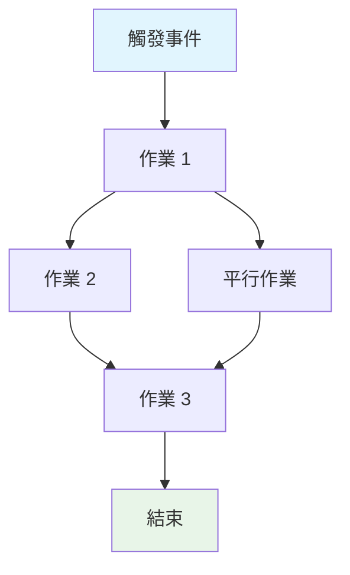
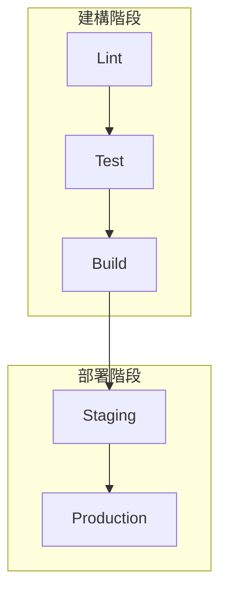

# 建立 GitHub Actions 工作流程規格

請為 GitHub Actions 工作流程：`${input:WorkflowFile}` 建立完整規格文件。

此規格文件用於說明工作流程的行為、需求與限制，重點在於「做什麼」而非「怎麼做」。

## AI 最佳化需求

- **Token 效率**：用精簡語言但不犧牲清晰度
- **結構化資料**：多用表格、清單、原理圖呈現密集資訊
- **語意清晰**：全程用精確術語
- **實作抽象化**：避免特定語法、指令或工具版本
- **可維護性**：設計便於工作流程演進時更新

## 規格範本

儲存路徑：`/spec/spec-process-cicd-[workflow-name].md`

```md
---
title: CI/CD 工作流程規格 - [工作流程名稱]
version: 1.0
date_created: [YYYY-MM-DD]
last_updated: [YYYY-MM-DD]
owner: DevOps Team
tags: [process, cicd, github-actions, automation, [domain-specific-tags]]
---

## 工作流程概述

**目的**：[一句話說明工作流程主要目標]
**觸發事件**：[列出觸發條件]
**目標環境**：[環境範圍]

## 執行流程原理圖



## 作業與相依

| 作業名稱 | 目的   | 相依       | 執行環境      |
| -------- | ------ | ---------- | ------------- |
| job-1    | [目的] | [前置作業] | [Runner/環境] |
| job-2    | [目的] | job-1      | [Runner/環境] |

## 需求矩陣

### 功能需求
| ID      | 需求   | 優先級 | 驗收標準     |
| ------- | ------ | ------ | ------------ |
| REQ-001 | [需求] | 高     | [可測試標準] |
| REQ-002 | [需求] | 中     | [可測試標準] |

### 安全需求
| ID      | 需求       | 實作限制   |
| ------- | ---------- | ---------- |
| SEC-001 | [安全需求] | [限制說明] |

### 效能需求
| ID       | 指標   | 目標     | 測量方式   |
| -------- | ------ | -------- | ---------- |
| PERF-001 | [指標] | [目標值] | [測量方式] |

## 輸入/輸出契約

### 輸入

```yaml
# 環境變數
ENV_VAR_1: string  # 目的：[說明]
ENV_VAR_2: secret  # 目的：[說明]

# 儲存庫觸發
paths: [路徑過濾清單]
branches: [分支模式清單]
```

### 輸出

```yaml
# 作業輸出
job_1_output: string  # 說明：[用途]
build_artifact: file  # 說明：[內容類型]
```

### 機密與變數

| 類型     | 名稱     | 目的   | 範圍     |
| -------- | -------- | ------ | -------- |
| Secret   | SECRET_1 | [用途] | 工作流程 |
| Variable | VAR_1    | [用途] | 儲存庫   |

## 執行限制

### 執行時限制

- **逾時**：[最大執行時間]
- **平行處理**：[平行執行上限]
- **資源限制**：[記憶體/CPU 限制]

### 環境限制

- **Runner 需求**：[OS/硬體需求]
- **網路存取**：[外部連線需求]
- **權限**：[所需存取層級]

## 錯誤處理策略

| 錯誤類型 | 回應   | 復原動作   |
| -------- | ------ | ---------- |
| 建構失敗 | [回應] | [復原步驟] |
| 測試失敗 | [回應] | [復原步驟] |
| 部署失敗 | [回應] | [復原步驟] |

## 品質門檻

### 門檻定義

| 門檻       | 標準     | 例外條件   |
| ---------- | -------- | ---------- |
| 程式品質   | [標準]   | [允許時機] |
| 安全掃描   | [門檻]   | [允許時機] |
| 測試覆蓋率 | [百分比] | [允許時機] |

## 監控與可觀測性

### 主要指標

- **成功率**：[目標百分比]
- **執行時間**：[目標時長]
- **資源使用**：[監控方式]

### 警示

| 條件   | 嚴重度 | 通知對象   |
| ------ | ------ | ---------- |
| [條件] | [等級] | [通知對象] |

## 整合點

### 外部系統

| 系統   | 整合類型 | 資料交換   | SLA 需求 |
| ------ | -------- | ---------- | -------- |
| [系統] | [類型]   | [資料格式] | [需求]   |

### 相依工作流程

| 工作流程   | 關係   | 觸發機制   |
| ---------- | ------ | ---------- |
| [工作流程] | [類型] | [觸發方式] |

## 合規與治理

### 稽核需求

- **執行日誌**：[保留政策]
- **核准門檻**：[所需核准]
- **變更管控**：[更新流程]

### 安全控管

- **存取控管**：[權限模型]
- **機密管理**：[輪替政策]
- **弱點掃描**：[掃描頻率]

## 邊界情境與例外

### 情境矩陣

| 情境       | 預期行為 | 驗證方式   |
| ---------- | -------- | ---------- |
| [邊界情境] | [行為]   | [驗證方式] |

## 驗證標準

### 工作流程驗證

- **VLD-001**：[驗證規則]
- **VLD-002**：[驗證規則]

### 效能基準

- **PERF-001**：[基準標準]
- **PERF-002**：[基準標準]

## 變更管理

### 更新流程

1. **規格更新**：先修改本文件
2. **審查與核准**：[核准流程]
3. **實作**：套用變更至工作流程
4. **測試**：[驗證方式]
5. **部署**：[發佈流程]

### 版本紀錄

| 版本 | 日期   | 變更內容 | 作者   |
| ---- | ------ | -------- | ------ |
| 1.0  | [日期] | 初始規格 | [作者] |

## 相關規格

- [連結至相關工作流程規格]
- [連結至基礎架構規格]
- [連結至部署規格]

```

## 分析指令

分析工作流程檔案時：

1. **萃取核心目的**：找出主要業務目標
2. **繪製作業流程**：建立作業相依圖，顯示執行順序
3. **識別契約**：記錄輸入、輸出與介面
4. **擷取限制**：萃取逾時、權限與資源限制
5. **定義品質門檻**：找出驗證與核准點
6. **記錄錯誤路徑**：繪製失敗情境與復原
7. **抽象實作**：聚焦行為，不記錄語法

## Mermaid 原理圖指引

### 流程類型
- **順序**：`A --> B --> C`
- **平行**：`A --> B & A --> C; B --> D & C --> D`
- **條件**：`A --> B{Decision}; B -->|Yes| C; B -->|No| D`

### 樣式
```mermaid
style TriggerNode fill:#e1f5fe
style SuccessNode fill:#e8f5e8
style FailureNode fill:#ffebee
style ProcessNode fill:#f3e5f5
```

### 複雜工作流程
5 個以上作業請用子圖：


## Token 最佳化策略

1. **用表格**：密集資訊用結構化格式
2. **一致縮寫**：定義一次，全程使用
3. **項目符號**：避免冗長段落
4. **程式區塊**：結構化資料優先於敘述
5. **交叉參照**：用連結取代重複資訊

請專注於建立同時具備文件與工作流程更新範本功能的規格。
