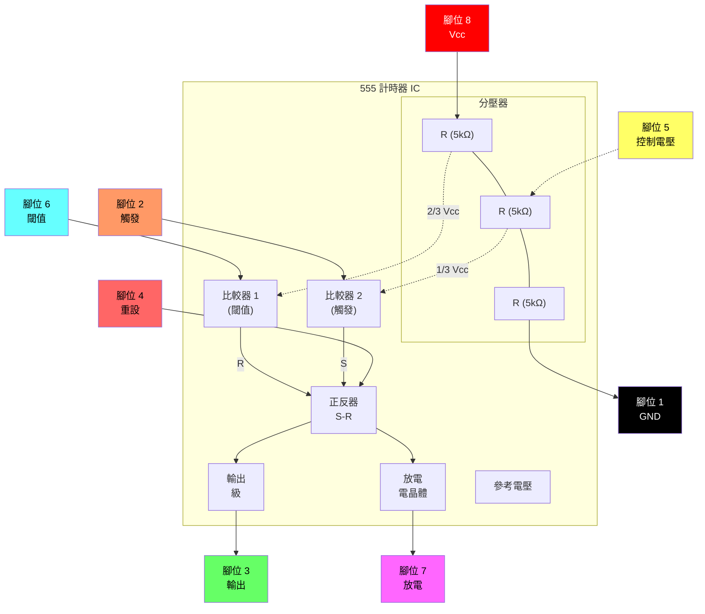
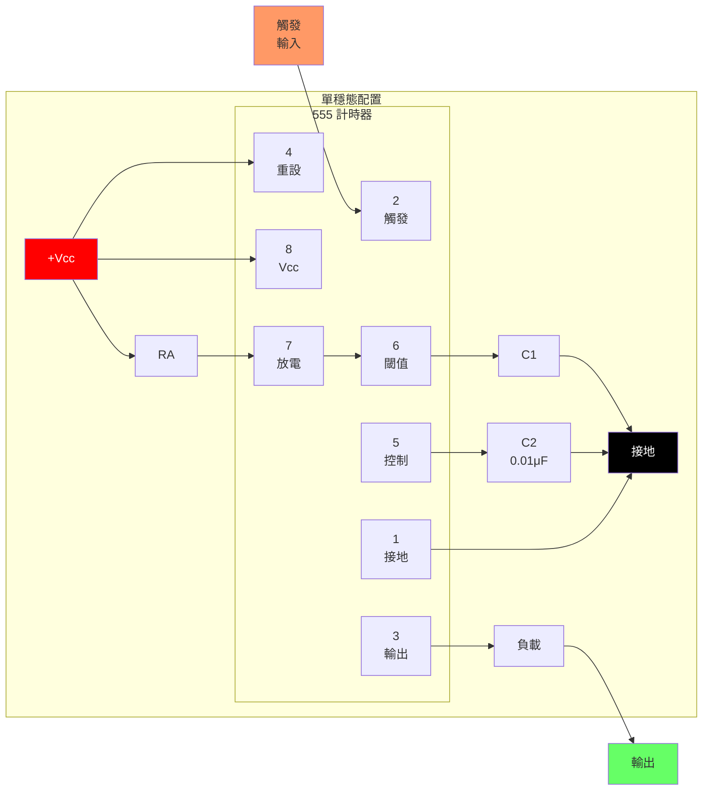
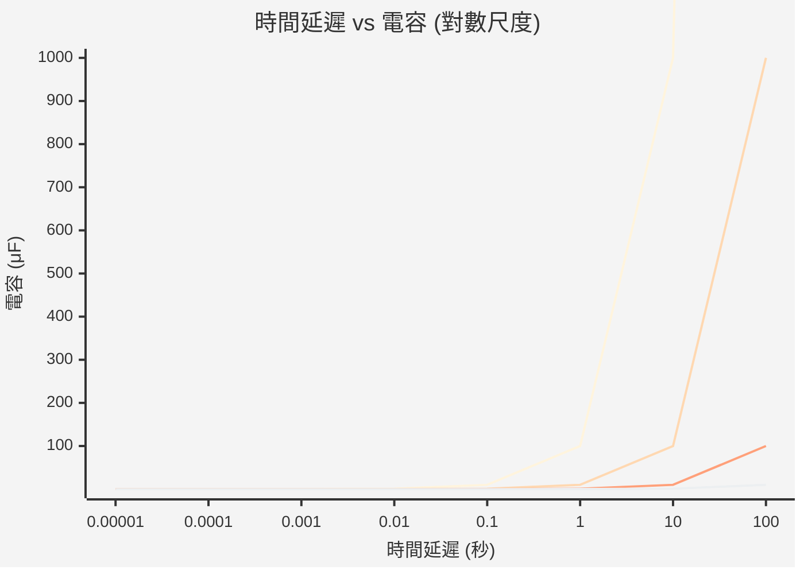
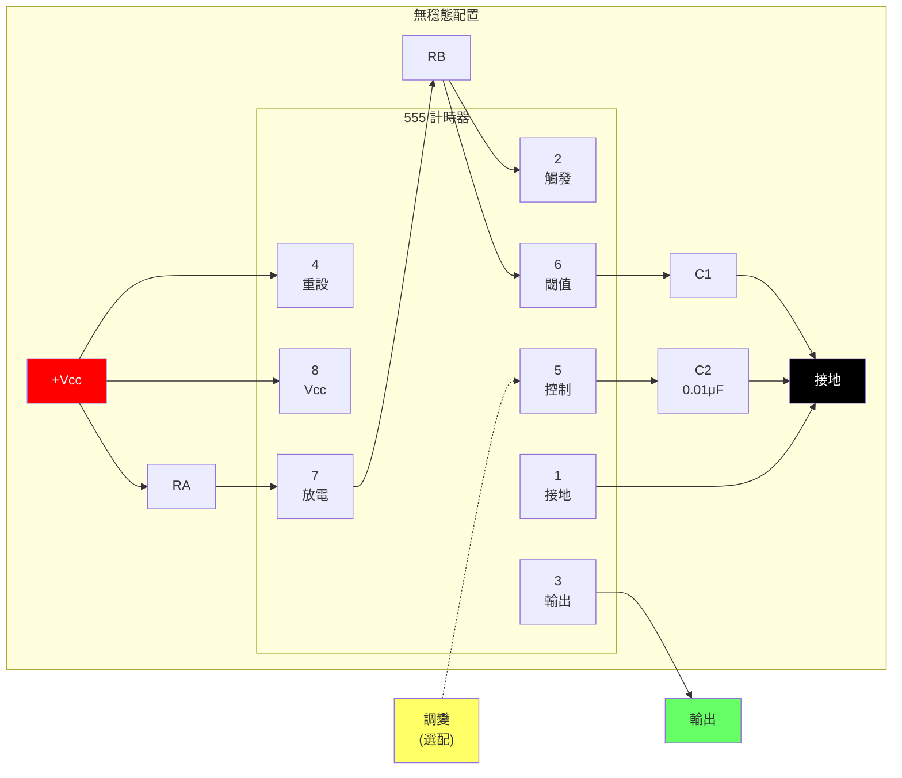
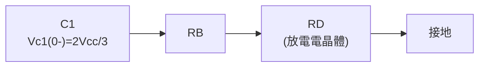
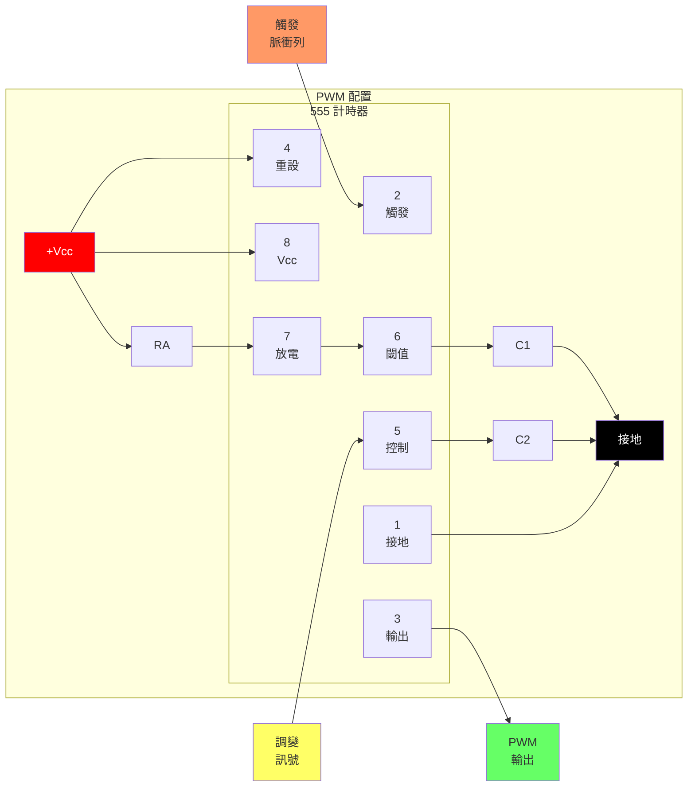
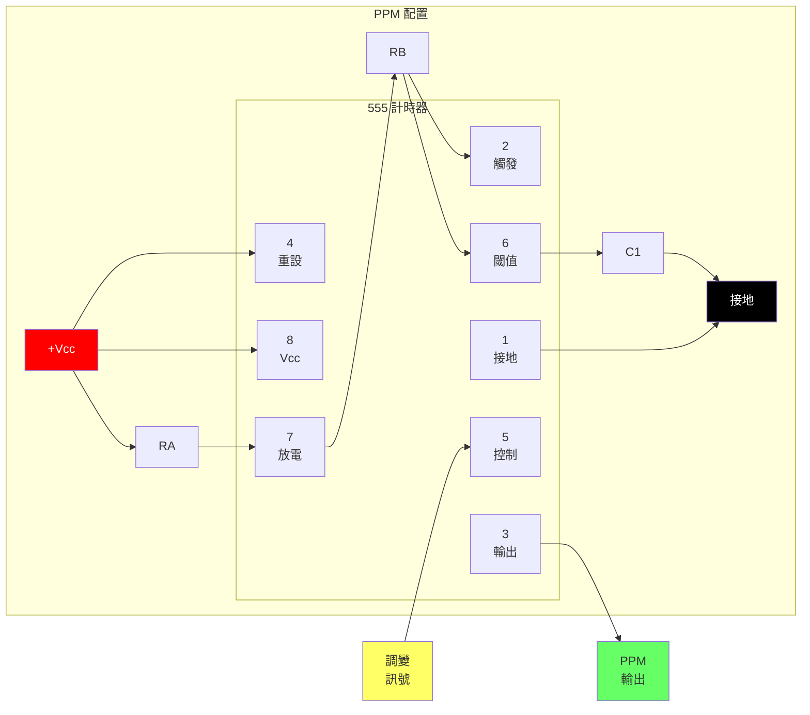
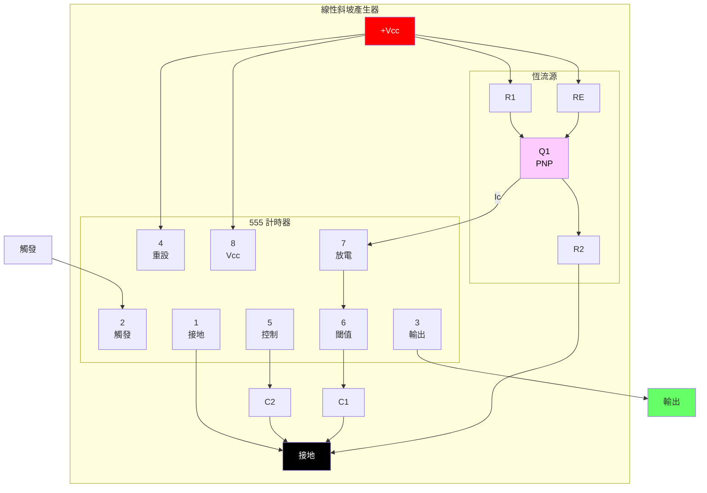

# 555

[www.fairchildsemi.com](www.fairchildsemi.com)

LM555/NE555/SA555 是一款高度穩定的控制器，能夠產生精確的定時脈衝。在單穩態操作中，時間延遲由一個外部電阻與一個電容控制。在無穩態操作中，頻率與工作週期由兩個外部電阻與一個電容精確控制。

## 特性

- 高電流驅動能力 (200mA)
- 可調工作週期
- 溫度穩定性為 0.005%/°C
- 定時範圍從微秒至小時
- 關閉時間小於 2μSec

## 應用程式

- 精確定時
- 脈衝產生
- 時間延遲產生
- 順序定時

## 內部方塊圖



**腳位配置：**

| 腳位 | 名稱 | 功能 |
|:---:|:---|:---:|
| 1 | GND | 接地參考 |
| 2 | TRIG | 觸發輸入 (< 1/3 Vcc 開始計時) |
| 3 | OUT | 輸出 (高或低) |
| 4 | RESET | 低電位有效重設 |
| 5 | CONT | 控制電壓 (2/3 Vcc 參考) |
| 6 | THRES | 閾值輸入 (> 2/3 Vcc 結束計時) |
| 7 | DISCH | 放電 (開集極) |
| 8 | Vcc | 電源電壓 (+4.5V 至 +16V) |

## 絕對最大額定值 (Ta = 25°C)

| 參數 | 符號 | 數值 | 單位 |
| :--- | :--- | :--- | :---:|
| 電源電壓 | Vcc | 16 | V |
| 引腳溫度 (焊接 10 秒) | Tled | 300 | °C |
| 功率消耗 | PD | 600 | mW |
| 操作溫度範圍<br>LM555/NE555<br>SA555 | Topr | - 65 ~ + 150 | °C |

## 電氣特性

(TA = 25°C, Vcc = 5 ~ 15V, 除非另有說明)

| 參數 | 符號 | 條件 | 最小值 | 典型值 | 最大值 | 單位 |
| :--- | :--- | :--- | :---: | :---: | :---: | :---:|
| 電源電壓 | Vcc | - | 4.5 | - | 16 | V |
| 電源電流 (低態穩定) (註 1) | Icc | Vcc = 5V, Rl = ∞<hr>Vcc = 15V, Rl = ∞ | -<hr>- | 3<hr>7.5 | 6<hr>15 | mA<hr>mA |
| 定時錯誤 (單穩態)<br>初始準確度 (註 2)<br>隨溫度偏移 (註 4)<br>隨電源電壓偏移 (註 4)<br> | ACCUR<br>Δt/ΔT<br>Δt/ΔVcc | Ra = 1kΩ 至 100kΩ<br>C = 0.1μF | - | 1.0<br>50<br>0.1 | 3.0<br><br>0.5 | %<br>ppm/°C<br>%/V |
| 定時錯誤 (無穩態)<br>初始準確度 (註 2)<br>隨溫度偏移 (註 4)<br>隨電源電壓偏移 (註 4) | ACCUR<br>Δt/ΔT<br>Δt/ΔVcc | Ra = 1kΩ 至 100kΩ<br> C = 0.1μF | - | 2.25<br>150<br>0.3 | - | %<br>ppm/°C<br>%/V |
| 控制電壓 | Vc | Vcc = 15V<hr> Vcc = 5V | 9.0<hr>2.6 | 10.0<hr>3.33 | 11.0<hr>4.0 | V<hr>V |
| 閾值電壓 | VTH | VCC = 15V<hr>VCC = 5V | -<hr>- | 10.0<hr>3.33 | -<hr>- | V<hr>V |
| 閾值電流 (註 3) | Ith | - | - | 0.1 | 0.25 | μA |
| 觸發電壓 | VTR | VCC = 5V<hr>VCC = 15V | 1.1<hr>4.5 | 1.67<hr>5 | 2.2<hr>5.6 | V<hr>V |
| 觸發電流 | ITR | VTR = 0V | 0.01 | 2.0 |  | μA |
| 重設電壓 | VRST | - | 0.4 | 0.7 | 1.0 | V |
| 重設電流 | IRST | - | 0.1 | 0.4 | mA |
| 低電位輸出電壓 | VOL | VCC = 15V<br>ISINK = 10mA<br>ISINK = 50mA<hr>VCC = 5V<br>ISINK = 5mA | -<hr>- | 0.06<br>0.3<hr>0.05 | 0.25<br>0.75<hr>0.35 | V<br>V<hr>V |
| 高電位輸出電壓 | VOH | VCC = 15V<br>ISOURCE = 200mA<br>ISOURCE = 100mA<hr>VCC = 5V<br>ISOURCE = 100mA | 12.75<hr>2.75 | 12.5<br>13.3<hr>3.3 | -<hr>- | V<br>V<hr>V |
| 輸出的上升時間 (註 4) | tR | - | - | 100 | - | ns |
| 輸出的下降時間 (註 4) | tF | - | - | 100 | - | ns |
| 放電洩漏電流 | ILKG | - | - | 20 | 100 | nA |

**備註：**

1. 當輸出為高電位時，電源電流通常比 VCC = 5V 時少 1mA。
2. 在 VCC = 5.0V 與 VCC = 15V 進行測試。
3. 這將決定 15V 操作時 RA + RB 的最大值，最大總 R = 20MΩ；以及 5V 操作時的最大值
   - 總 R = 8.7MΩ
4. 這些參數雖然有保證，但並未在生產中進行 100% 測試。

## 應用資訊

下方表 1 是 555 計時器的基本操作表：

| 閾值電壓<br>(Vth)(腳位 6) | 觸發電壓<br>(Vtr)(腳位 2) | 重設 (腳位 4) | 輸出 (腳位 3) | 放電電晶體<br>(腳位 7) |
| :--- | :--- | :--- | :--- | :---:|
| 不在乎 | 不在乎 | 低 (Low) | 低 (Low) | 開啟 (ON) |
| Vth > 2Vcc / 3 | Vth > 2Vcc / 3 | 高 (High) | 低 (Low) | 開啟 (ON) |
| Vcc / 3 < Vth < 2 Vcc / 3 | Vcc / 3 < Vth < 2 Vcc / 3 | 高 (High) | - | - |
| Vth < Vcc / 3 | Vth < Vcc / 3 | 高 (High) | 高 (High) | 關閉 (OFF) |

當低電位訊號輸入應用於重設端子時，不論閾值電壓或觸發電壓為何，計時器輸出皆保持低電位。僅當高電位訊號應用於重設端子時，計時器的輸出才會根據閾值電壓與觸發電壓而改變。當計時器輸出為高電位且閾值電壓超過電源電壓的 2/3 時，計時器的內部放電電晶體會開啟，將閾值電壓降低至電源電壓的 1/3 以下。在此期間，計時器輸出維持低電位。隨後，如果低電位訊號應用於觸發電壓使其變為電源電壓的 1/3，則計時器的內部放電電晶體會關閉，增加閾值電壓並再次驅動計時器輸出為高電位。

### 1. 單穩態操作

#### 圖 1. 單穩態電路



**元件數值：**

- RA：定時電阻 (典型值 1kΩ 至 10MΩ)
- C1：定時電容
- C2：旁路電容 (建議 0.01μF)
- RL：負載電阻

**時間延遲公式：**
$$t_d = 1.1 \times R_A \times C_1$$

#### 圖 2. 電阻與電容 vs. 時間延遲 (td)



| RA | C1 | 時間延遲 (td) |
|:---|:---|:---:|
| 1 kΩ | 0.1 μF | 110 μs |
| 10 kΩ | 0.1 μF | 1.1 ms |
| 100 kΩ | 0.1 μF | 11 ms |
| 1 MΩ | 1 μF | 1.1 s |
| 10 MΩ | 10 μF | 110 s |

#### 圖 3. 單穩態操作的波形

```mermaid
%%{init: {'theme': 'base'}}%%
gantt
    title 單穩態波形 (正常操作)
    dateFormat X
    axisFormat %s
    
    section 觸發
    高 (Vcc)    :a1, 0, 2
    低 (<Vcc/3)  :crit, a2, 2, 3
    高 (Vcc)    :a3, 3, 10
    
    section 輸出
    低 (0V)      :b1, 0, 2
    高 (Vcc)    :active, b2, 2, 8
    低 (0V)      :b3, 8, 10
    
    section 閾值 (Vc1)
    充電中      :c1, 2, 8
```



```
    觸發    ─────┐     ┌─────────────────────
    (腳位 2)      └─────┘  
                    ↓ 觸發脈衝
                    
    輸出    ─────────┐          ┌───────────
    (腳位 3)         └──────────┘
                    |←── td ───→|
                    
    閾值             /‾‾‾‾‾‾‾‾\ 
    (腳位 6)    ─────/          \────────────
               0V  ↗            ↘  
                  Vcc/3      2Vcc/3
                  
    td = 1.1 × RA × C1
```

圖 1 說明了一個單穩態電路。在此模式中，每當觸發電壓降至 Vcc/3 以下時，計時器就會產生一個固定的脈衝。當應用於第 2 號腳位的觸發脈衝電壓降至 Vcc/3 以下且計時器輸出為低電位時，計時器的內部正反器會關閉放電電晶體，並藉由為外部電容 C1 充電同時設定正反器輸出，使計時器輸出變為高電位。外部電容 C1 兩端的電壓 VC1 會以時間常數 t=RA*C 指數增長，並在 td=1.1RA*C 時達到 2Vcc/3。因此，電容 C1 透過電阻 RA 充電。時間常數 RAC 越大，VC1 達到 2Vcc/3 所需的時間就越長。換言之，時間常數 RAC 控制輸出脈衝寬度。當電容 C1 的外加電壓達到 2Vcc/3 時，觸發端子上的比較器會重設正反器，開啟放電電晶體。此時，C1 開始放電，計時器輸出轉為低電位。以這種方式，在單穩態運作的計時器會重複上述過程。圖 2 顯示了基於 RA 與 C 的時間常數關係。圖 3 顯示了單穩態操作期間的一般波形。必須注意的是，為了正常操作，在計時器輸出轉為低電位之前，觸發脈衝電壓需要維持至少 Vcc/3。也就是說，雖然在輸出為高電位時即使施加不同的觸發脈衝，輸出也不受影響，但如果輸出脈衝結束時的觸發脈衝電壓仍低於 Vcc/3，則可能會受到影響且波形無法正常運作。圖 4 顯示了這種計時器輸出異常。

#### 圖 4. 單穩態操作的波形 (異常)

```
    觸發    ─────┐  ┌──┐  ┌─────────────────
    (腳位 2)      └─┘  └─┘  
                 ↓     ↓ 在輸出高電位期間重新觸發
                    
    輸出    ─────────┐                ┌─────
    (腳位 3)         └────────────────┘
                    |←── 延長的 td ──→|
                    
    閾值             /‾‾‾‾‾‾‾‾‾‾‾‾‾‾‾‾\ 
    (腳位 6)    ─────/                  \────
               0V  ↗                    ↘  
                  Vcc/3              2Vcc/3

    ⚠️ 異常：觸發維持低電位會延長輸出脈衝！
    觸發必須在輸出變為低電位之前回到高電位。
```

**備註：** 為確保正常操作，觸發脈衝電壓必須在計時器輸出變為低電位之前回到 Vcc/3 以上。如果觸發維持在 Vcc/3 以下，輸出脈衝將會異常延長。

### 2. 無穩態操作

#### 圖 5. 無穩態電路



**元件數值：**

- RA：充電電阻 (控制高電位時間)
- RB：充電/放電電阻 (影響高電位與低電位時間)  
- C1：定時電容
- C2：旁路電容 (建議 0.01μF)

**定時公式：**

- 高電位時間：$t_H = 0.693 \times (R_A + R_B) \times C_1$
- 低電位時間：$t_L = 0.693 \times R_B \times C_1$
- 週期：$T = t_H + t_L = 0.693 \times (R_A + 2R_B) \times C_1$
- 頻率：$f = \frac{1}{1.44}{(R_A + 2R_B) \times C_1}$
- 工作週期：$D = \frac{R_A + R_B}{R_A + 2R_B}$

#### 圖 6. 電容與電阻 vs. 頻率

```mermaid
%%{init: {'theme': 'base'}}%%
xychart-beta
    title "自由運行頻率 vs 電容"
    x-axis "頻率 (Hz)" [0.1, 1, 10, 100, 1000, 10000, 100000]
    y-axis "電容 (μF)" 0.001 --> 100
```

| (RA + 2RB) | C1 | 頻率 |
|:---|:---|:---:|
| 1.44 kΩ | 1 μF | 1 kHz |
| 14.4 kΩ | 1 μF | 100 Hz |
| 144 kΩ | 1 μF | 10 Hz |
| 14.4 kΩ | 0.1 μF | 1 kHz |
| 14.4 kΩ | 0.01 μF | 10 kHz |

#### 圖 7. 無穩態操作的波形

```
    輸出    ────┐     ┌─────┐     ┌─────┐     ┌────
    (腳位 3)    └─────┘     └─────┘     └─────┘
               |←tL→|←─tH─→|←tL→|←─tH─→|
               
    閾值             /
    (腳位 6)   ─────/  \──────/  \──────/  \──────
              Vcc/3    2Vcc/3
              
              ├────── T ──────┤
              T = tH + tL = 0.693(RA + 2RB)C1
              
    充電：      C1 透過 RA + RB 充電
    放電：      C1 僅透過 RB 放電
```

**典型值：** RA = 1kΩ, RB = 1kΩ, C1 = 1μF, Vcc = 5V

無穩態計時器操作是透過在圖 1 中加入電阻 RB 並依照圖 5 配置而成的。在無穩態操作中，觸發端子與閾值端子相連，形成自我觸發，作為多諧振盪器運作。當計時器輸出為高電位時，其內部放電電晶體會關閉，VC1 依時間常數 (RA+RB)*C 按指數函式增加。當 VC1 (即閾值電壓) 達到 2Vcc/3 時，觸發端子上的比較器輸出變為高電位，重設正反器並使計時器輸出變為低電位。這進而開啟了放電電晶體，C1 透過 RB 與放電電晶體形成的放電通道放電。當 VC1 降至 Vcc/3 以下時，觸發端子上的比較器輸出變為高電位，計時器輸出再次變為高電位。放電電晶體關閉，VC1 再次上升。在上述過程中，計時器輸出為高電位的區間是 VC1 從 Vcc/3 上升到 2Vcc/3 所需的時間，而計時器輸出為低電位的區間是 VC1 從 2Vcc/3 下降到 Vcc/3 所需的時間。當計時器輸出為高電位時，充電電容 C1 的等效電路如下：

#### 等式 1：充電電路等效


**充電方程式：**
$$C_1 \frac{dV_{C1}}{dt} = \frac{V_{CC} - V_{(0-)}}{R_A + R_B} \quad (1)$$

$$V_{C1}(0^+) = \frac{V_{CC}}{3} \quad (2)$$

$$V_{C1}(t) = V_{CC} \left[ 1 - \frac{2}{3} e^{-\frac{t}{(R_A + R_B)C_1}} \right] \quad (3)$$

由於計時器輸出高電位狀態的持續時間 (tH) 是 VC1(t) 達到 2Vcc/3 所需的時間，

#### 等式 2：高電位時間計算

$$\frac{2}{3}V_{CC} = V_{CC} \left[ 1 - \frac{2}{3} e^{-\frac{t_H}{(R_A + R_B)C_1}} \right] \quad (4)$$

$$t_H = C_1(R_A + R_B) \ln 2 = 0.693(R_A + R_B)C_1 \quad (5)$$

當計時器輸出為低電位時，放電電容 C1 的等效電路如下：

#### 等式 3：放電電路等效



**放電方程式：**
$$C_1 \frac{dV_{C1}}{dt} + \frac{1}{R_A + R_B} V_{C1} = 0 \quad (6)$$

$$V_{C1}(t) = \frac{2}{3} V_{CC} e^{-\frac{t}{(R_A + R_B)C_1}} \quad (7)$$

由於計時器輸出低電位狀態的持續時間 (tL) 是 VC1(t) 達到 Vcc/3 所需的時間，

#### 等式 4：低電位時間計算

$$\frac{1}{3}V_{CC} = \frac{2}{3}V_{CC} e^{-\frac{t_L}{(R_B + R_D)C_1}} \quad (8)$$

$$t_L = C_1(R_B + R_D) \ln 2 = 0.693(R_A + R_B)C_1 \quad (9)$$

由於 RD 雖然與放電電晶體的大小有關，但通常 RB>>RD，故 tL=0.693RBC1 (10)
因此，如果計時器在無穩態運作，週期等於 'T=tH+tL=0.693(RA+RB)C1+0.693RBC1=0.693(RA+2RB)C1'，因為週期是充電時間與放電時間之和。由於頻率是週期的倒數，適用以下公式。

#### 等式 5：頻率公式

$$f = \frac{1}{T} = \frac{1.44}{(R_A + 2R_B)C_1} \quad (11)$$

### 3. 分頻器

藉由調整定時週期的長度，圖 1 的基本電路可以作為分頻器使用。圖 8 說明了一個除以三的電路，利用了定時週期內無法重新觸發的事實。

#### 圖 8. 分頻器操作的波形

```
    觸發    ─┐ ┌─┐ ┌─┐ ┌─┐ ┌─┐ ┌─┐ ┌─┐ ┌─┐ ┌─┐ ┌─┐ ┌─
    (輸入)  └─┘ └─┘ └─┘ └─┘ └─┘ └─┘ └─┘ └─┘ └─┘ └─┘
             1   2   3   1   2   3   1   2   3
             
    輸出    ─┐        ┌──┐        ┌──┐        ┌──────
    (÷3)     └────────┘  └────────┘  └────────┘
             |← 跳過 →|  |← 跳過 →|  |← 跳過 →|
                2,3          2,3         2,3
                
    閾值           /‾‾‾‾\        /‾‾‾‾\        /‾‾‾‾\ 
    (Vc1)    ─────/      \──────/      \──────/      \──────
             
    RA = 9.1kΩ, RB = 1kΩ, C1 = 0.01μF, Vcc = 5V
    
    ⚙️ N 分頻：設定定時使輸出忽略 (N-1) 個觸發脈衝
```

### 4. 脈衝寬度調變 (PWM)

透過調變應用於計時器腳位 5 的控制電壓並變更計時器內部比較器的參考值，可以改變計時器輸出波形。圖 9 說明了脈衝寬度調變電路。當連續觸發脈衝列在單穩態模式中應用時，計時器輸出寬度會根據應用於控制端子的訊號進行調變。正弦波以及其他波形皆可作為訊號應用於控制端子。圖 10 顯示了脈衝寬度調變波形的範例。

#### 圖 9. 脈衝寬度調變配置電路



#### 圖 10. 脈衝寬度調變的波形

```
    控制    ╭──────╮      ╭──────╮      ╭──────╮
    (腳位 5)│      │      │      │      │      │
          ───╯      ╰──────╯      ╰──────╯      ╰───
             |← 調變訊號 (例如，正弦波) →|
                    
    觸發    ─┐ ┌─┐ ┌─┐ ┌─┐ ┌─┐ ┌─┐ ┌─┐ ┌─┐ ┌─┐ ┌─┐
             └─┘ └─┘ └─┘ └─┘ └─┘ └─┘ └─┘ └─┘ └─┘ └─┘
             
    輸出    ─┐  ┌─┐   ┌───┐   ┌─┐  ┌─┐   ┌───┐   ┌─
    (PWM)    └──┘ └───┘   └───┘ └──┘ └───┘   └───┘
             |←w1→|←w2─→|←w3──→|
             
    脈衝寬度隨控制電壓而變：
    - 較高的控制電壓 → 較長的脈衝寬度
    - 較低的控制電壓 → 較短的脈衝寬度
    
    RA = 3.9kΩ, RB = 1kΩ, RL = 1kΩ, C1 = 0.01μF, Vcc = 5V
```

### 5. 脈衝位置調變 (PPM)

如果在計時器按圖 11 連接為無穩態操作時將調變訊號應用於控制端子，則計時器將變為脈衝位置調變器。在脈衝位置調變器中，計時器內部比較器的參考值會被調變，進而根據應用於控制端子的調變訊號來調變計時器輸出。圖 12 說明了用於調變訊號的正弦波以及產生的輸出脈衝位置調變；然而，亦可使用任何波形。

#### 圖 11. 脈衝位置調變配置電路



#### 圖 12. 脈衝位置調變的波形

```
    控制    ╭────────────╮          ╭────────────╮
    (腳位 5)│            │          │            │
          ───╯            ╰──────────╯            ╰───
                調變訊號 (正弦波)
                    
    閾值             /
    (腳位 6)  ────/  \──/  \────/  \────/  \──/  \────
                        
    輸出    ─┐ ┌─┐  ┌──┐    ┌────┐    ┌──┐  ┌─┐ ┌─
    (PPM)    └─┘ └──┘  └────┘    └────┘  └──┘ └─┘
             |←t1→|←t2─→|←─t3──→|
             
    脈衝間距隨控制電壓而變：
    - 較高的控制電壓 → 較長的週期
    - 較低的控制電壓 → 較短的週期
    
    RA = 1kΩ, RB = 1kΩ, C1 = 1nF, Vcc = 5V
```

### 6. 線性斜坡 (Linear Ramp)

當圖 1 所示單穩態電路中的上拉電阻 RA 被替換為恆流源時，VC1 會線性增加，產生線性斜坡。圖 13 顯示了線性斜坡產生電路，圖 14 說明了產生的線性斜坡波形。

#### 圖 13. 線性斜坡產生電路



#### 圖 14. 線性斜坡的波形

```
    觸發    ─────┐     ┌───────────────────────────
    (腳位 2)      └─────┘  
                    ↓ 觸發脈衝
                    
    輸出    ─────────┐              ┌───────────────
    (腳位 3)         └──────────────┘
                    |←──── td ────→|
                    
    閾值             ╱              線性斜坡 (非指數)
    (腳位 6)    ─────╱               
               0V  ↗                 
                  Vcc/3           2Vcc/3
                  
    線性斜坡：Vc1 = (Ic/C1) × t
    斜率 S = Ic/C1
    
    R1 = 47kΩ, R2 = 100kΩ, RE = 2.7kΩ, RL = 1kΩ, C1 = 0.01μF, Vcc = 5V
```

在圖 13 中，電流源由 PNP 電晶體 Q1 與電阻 R1、R2 及 RE 建立。

#### 等式 6：電流源計算

$$I_C = \frac{V_{CC} - V_E}{R_E} \quad (12)$$

此處，VE 為：

$$V_E = V_{BE} + \frac{R_2}{R_1 + R_2} V_{CC} \quad (13)$$

例如，如果 Vcc=15V, RE=20kΩ, R1=5kΩ, R2=10kΩ, 且 VBE=0.7V, 則 VE=0.7V+10V=10.7V, Ic=(15-10.7)/20k=0.215mA

當觸發在如圖 13 配置的計時器中啟動時，流經電容 C1 的電流變成由 PNP 電晶體與電阻產生的恆定電流。因此，VC 是一個如圖 14 所示的線性斜坡函式。線性斜坡函式的梯度 S 定義如下：

#### 等式 7：斜坡斜率

$$S = \frac{V_{P-P}}{T} \quad (14)$$

此處 Vp-p 是峰對峰電壓。如果將電容中累積的電荷量除以電容，則 VC 如下：

```
V = Q/C (15)
```

上述等式兩邊各除以 T 得到

#### 等式 8：簡化的斜坡斜率

$$\frac{V}{T} = \frac{Q/T}{C} \quad (16)$$

並可簡化為以下等式。

```
S = I/C (17)
```

換句話說，出現在電容兩端的線性斜坡函式的梯度可以透過使用流經電容的恆定電流來獲得。如果流經電容的恆定電流為 0.215mA 且電容為 0.02μF，則電容兩端斜坡函式的梯度為 S = 0.215m/0.022μ = 9.77V/ms。

# 機械尺寸

## 封裝

### 8-DIP (雙列直插式封裝)

```
    ┌─────────────────────────────────────┐
    │  ●                                  │
    │  #1                             #8  │
    │  ┌──┐                         ┌──┐  │
    │  │  │                         │  │  │
    │  └──┘                         └──┘  │
    │  #2                             #7  │
    │  ┌──┐       555 計時器         ┌──┐  │
    │  │  │                         │  │  │
    │  └──┘                         └──┘  │
    │  #3                             #6  │
    │  ┌──┐                         ┌──┐  │
    │  │  │                         │  │  │
    │  └──┘                         └──┘  │
    │  #4                             #5  │
    │  ┌──┐                         ┌──┐  │
    │  │  │                         │  │  │
    │  └──┘                         └──┘  │
    └─────────────────────────────────────┘
```

**8-DIP 尺寸 (以公釐為單位)：**

| 參數 | 最小值 | 標稱值 | 最大值 |
|:---|:---:|:---:|:---:|
| 封裝長度 | - | 9.60 | - |
| 封裝寬度 | 6.20 | 6.40 | 6.60 |
| 封裝高度 | - | 5.08 | - |
| 引腳間距 | - | 2.54 | - |
| 引腳寬度 | 0.36 | 0.46 | 0.56 |
| 引腳厚度 | - | 0.33 | - |
| 引腳長度 | 2.92 | 3.30 | 3.68 |
| 離地高度 | 0.51 | - | - |

```
              6.40 ± 0.20
         ┌────────────────┐
         │                │
    ┌────┤                ├────┐
    │    │                │    │  9.60
    │    │                │    │  最大
    │    │                │    │
    └────┤                ├────┘
         │                │
         └────────────────┘
              ↕ 2.54 (引腳間距)
         
    側視圖：
         ┌────────────────┐
    5.08 │                │
    最大  └──┬──┬──┬──┬──┬─┘
            │  │  │  │  │   3.30 ± 0.30
            │  │  │  │  │   (引腳長度)
         ═══╧══╧══╧══╧══╧═══
                ↕ 0.33 最小
```

### 8-SOP (小外形封裝)

```
    ┌───────────────────────────────┐
    │  ●                            │
    │  #1                       #8  │
    │  ─┐                       ┌─  │
    │   │                       │   │
    ├───┴───────────────────────┴───┤
    │           555 計時器           │
    ├───┬───────────────────────┬───┤
    │   │                       │   │
    │  ─┘                       └─  │
    │  #4                       #5  │
    └───────────────────────────────┘
```

**8-SOP 尺寸 (以公釐為單位)：**

| 參數 | 最小值 | 標稱值 | 最大值 |
|:---|:---:|:---:|:---:|
| 封裝長度 | 4.72 | 4.92 | 5.12 |
| 封裝寬度 | 5.70 | 6.00 | 6.30 |
| 封裝高度 | - | 1.55 | 1.75 |
| 引腳間距 | - | 1.27 | - |
| 引腳寬度 | 0.31 | 0.41 | 0.51 |
| 引腳長度 (末端) | 0.40 | 0.80 | 1.27 |
| 離地高度 | 0.05 | 0.15 | 0.25 |
| 總寬度 (含引腳) | - | 6.00 | - |

```
              6.00 ± 0.30
         ┌────────────────┐
    ─┐   │                │   ┌─
     │   │                │   │   4.92 ± 0.20
    ─┘   │                │   └─
         └────────────────┘
              ↕ 1.27 (引腳間距)
         
    側視圖：
              1.55 ± 0.20
         ┌────────────────┐
    最大  │                │
         └──┬──┬──┬──┬──┬─┘
            └──┴──┴──┴──┴── 0.10~0.25 離地高度
```

## 腳位指派摘要

| 腳位 | 符號 | 8-DIP | 8-SOP | 描述 |
|:---:|:---:|:---:|:---:|:---:|
| 1 | GND | ● | ● | 接地 (0V) |
| 2 | TRIG | ● | ● | 觸發輸入 |
| 3 | OUT | ● | ● | 輸出 |
| 4 | RESET | ● | ● | 重設 (低電位有效) |
| 5 | CONT | ● | ● | 控制電壓 |
| 6 | THRES | ● | ● | 閾值輸入 |
| 7 | DISCH | ● | ● | 放電 |
| 8 | Vcc | ● | ● | 電源電壓 |
