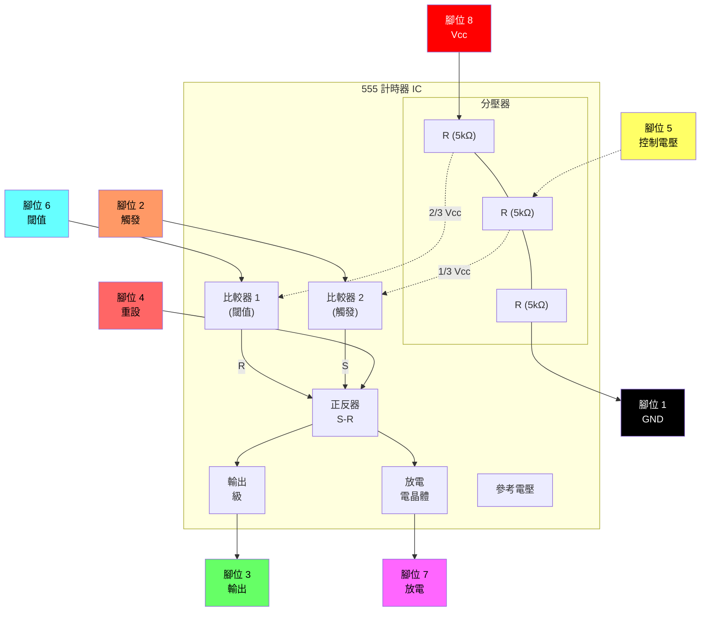

# 連接電子元件

本指南提供在麵包板上建置電子電路的逐步指示。每個建置都逐步引入新的元件與概念。

---

## 基礎元件建置說明

### 建置 1 — 單個 LED

**元件：** 紅色 LED、黑色跳線、紅色跳線、電池與電池座

**步驟：**

1. 將黑色跳線從 **A5** 插入麵包板到 **A14**。
2. 將紅色跳線從 **J5** 插入麵包板到 **J14**。
3. 將紅色 LED 放入第 14 行，正極（兩支腳中較長的一支）在右側，與紅色線對齊；負極在左側，與黑色線對齊。
4. 將電池放入其電池座中，並將其放入麵包板，將負極連接到黑色，正極連接到紅色。

**結果：** 當您插入電池時，LED 將會發光。

**疑難排解：**

- 您的 LED 是否反向插入？
- 跳線是否與 LED 引腳在同一行？
- 跳線是否與電池端子在同一行？

---

### 建置 2 — 單個按鈕

**元件：** 紅色 LED、按鈕、黑色跳線、紅色跳線、電池與電池座

**步驟：**

1. 將黑色跳線從 **A5** 插入麵包板到 **A16**。
2. 將紅色跳線從 **J5** 插入麵包板到 **J12**。
3. 將紅色 LED 放入麵包板，正極（兩支腳中較長的一支）插入 **H15**，負極插入 **G17**。
4. 將按鈕水平放置在麵包板中央，使左下腳位位於第 16 行（與黑色跳線對齊），右上腳位位於第 14 行（與紅色 LED 的負極對齊）。
5. 將電池放入其電池座中，並將其放入麵包板，將負極連接到黑色，正極連接到紅色。

**結果：** 當您按下按鈕時，LED 將會發光。

**疑難排解：**

- 您的 LED 是否反向插入？
- 跳線是否與 LED 引腳在同一行？
- 跳線是否與電池端子在同一行？

---

### 建置 3 — 光敏電阻調光 LED

**元件：** 綠色 LED、光敏電阻、黑色跳線、紅色跳線、電池與電池座

**步驟：**

1. 將黑色跳線從 **A5** 插入麵包板到 **A12**。
2. 將紅色跳線從 **J5** 插入麵包板到 **J13**。
3. 將綠色 LED 放入麵包板，正極（兩支腳中較長的一支）插入 **F13**，負極插入 **E13**。
4. 將光敏電阻從 **C12** 插入麵包板到 **D13**。
5. 將電池放入其電池座中，並將其放入麵包板，將負極連接到黑色，正極連接到紅色。

**結果：** 當您插入電池時，LED 將會發光。遮住光敏電阻將會導致 LED 變暗。

---

### 建置 4 — 雙 LED 按鈕

**元件：** 紅色 LED、綠色 LED、220Ω 電阻、按鈕、黑色跳線、紅色跳線、電池與電池座

**步驟：**

1. 將黑色跳線從 **A5** 插入麵包板到 **A11**。
2. 將紅色跳線從 **J5** 插入麵包板到 **J11**。
3. 將 220Ω 電阻從 **I11** 插入麵包板到 **I15**。
4. 將按鈕水平放置在麵包板中央，使上方腳位位於第 15 行且在麵包板相對的兩側。
5. 將紅色 LED 放入麵包板，正極（兩支腳中較長的一支）插入 **C17**，負極插入 **B11**。
6. 將綠色 LED 放入麵包板，正極插入 **G15**，負極插入 **E11**。
7. 將電池放入其電池座中，並將其放入麵包板，將負極連接到黑色，正極連接到紅色。

**結果：** 當您插入電池時，綠色 LED 將會發光。當您按下按鈕時，綠色 LED 將會熄滅，紅色 LED 將會發光。

### 建置 5 — 光敏電阻閃爍 LED

- 將黑色跳線從 A3 插入麵包板到 A12。
- 將紅色跳線從 J3 插入麵包板到 J12。
- 將 555 積體電路晶片放入麵包板中央，上方腳位在第 12 行。
- 將一條跳線插入麵包板，連接 D15 到 G12。
- 將一條跳線插入麵包板，連接 D13 到 G14。
- 將 1000Ω 電阻從 C14 插入麵包板到 H17。
- 將光敏電阻從 B14 插入麵包板到 B15。
- 將電容從 A13 插入麵包板到 B12。
- 將綠色 LED 放入麵包板，正極（兩支腳中較長的一支）插入 F17，負極插入 C12。
- 將紅色 LED 放入麵包板，正極插入 I12，負極插入 J17。
- 將電池放入其電池座中，並將其放入麵包板，將負極連接到黑色，正極連接到紅色。

當您插入電池時，兩個 LED 將開始快速閃爍。遮住光敏電阻以阻擋光線將會減緩 LED 的閃爍頻率。

---

## 555 計時器 IC 參考

555 計時器是一款多功能的積體電路，用於定時、脈衝產生與振盪器應用。以下章節提供腳位資訊與內部電路詳細資訊。

### 555 腳位圖

```
    ┌─────────────────────────────────────┐
    │  ●                                  │
    │  #1                             #8  │
    │  ┌──┐                         ┌──┐  │
    │  │  │                         │  │  │
    │  └──┘                         └──┘  │
    │  #2                             #7  │
    │  ┌──┐       555 計時器         ┌──┐  │
    │  │  │                         │  │  │
    │  └──┘                         └──┘  │
    │  #3                             #6  │
    │  ┌──┐                         ┌──┐  │
    │  │  │                         │  │  │
    │  └──┘                         └──┘  │
    │  #4                             #5  │
    │  ┌──┐                         ┌──┐  │
    │  │  │                         │  │  │
    │  └──┘                         └──┘  │
    └─────────────────────────────────────┘
```

### 555 腳位說明

| 腳位 | 符號 | 功能 |
|:---:|:---:|:---|
| 1 | GND | 接地參考 (0V) |
| 2 | TRIG | 觸發輸入 — 當電壓降至 ⅓ Vcc 以下時開始定時週期 |
| 3 | OUT | 輸出 — 提供高電位或低電位訊號 |
| 4 | RESET | 重設輸入 (低電位有效) — 當接地時強迫輸出為低電位 |
| 5 | CONT | 控制電壓 — 提供存取內部分壓器 (⅔ Vcc) 的途徑 |
| 6 | THRES | 閾值輸入 — 當電壓超過 ⅔ Vcc 時結束定時週期 |
| 7 | DISCH | 放電 — 用於為定時電容放電的開集極輸出 |
| 8 | Vcc | 電源電壓 (+4.5V 至 +16V) |

### 555 內部方塊圖



---

### 建置 6 — 按鈕蜂鳴器

**元件：** 555 計時器 IC、壓電喇叭、220Ω 電阻、1000Ω 電阻、電容、按鈕、跳線、電池與電池座

**步驟：**

1. 將黑色跳線從 **A1** 插入麵包板到 **A11**。
2. 將紅色跳線從 **J1** 插入麵包板到 **J11**。
3. 將 555 積體電路晶片放入麵包板中央，上方腳位在第 11 行。
4. 將一條跳線插入麵包板，連接 **D12** 到 **G13**。
5. 將一條跳線插入麵包板，連接 **D14** 到 **G11**。
6. 將電容從 **A12** 插入麵包板到 **B11**。
7. 將 220Ω 電阻從 **C12** 插入麵包板到 **C13**。
8. 將按鈕水平放置在麵包板中央，使上方腳位位於第 15 行且在麵包板相對的兩側。
9. 將壓電喇叭插入麵包板，正極腳位在 **A9**，負極腳位在 **A6**。
10. 將 1000Ω 電阻從 **E6** 插入麵包板到 **A13**。
11. 將一條跳線插入麵包板，連接 **C9** 到 **D15**。
12. 將一條跳線插入麵包板，連接 **G17** 到 **I11**。
13. 將電池放入其電池座中，並將其放入麵包板，將負極連接到黑色，正極連接到紅色。

**結果：** 當您按下按鈕時，蜂鳴器將會發出聲響。

---

### 建置 7 — 光敏電阻特雷門 (Theremin)

**元件：** 555 計時器 IC、壓電喇叭、光敏電阻、1000Ω 電阻、電容、按鈕、跳線、電池與電池座

**步驟：**

1. 將黑色跳線從 **A1** 插入麵包板到 **A11**。
2. 將紅色跳線從 **J1** 插入麵包板到 **J11**。
3. 將 555 積體電路晶片放入麵包板中央，上方腳位在第 11 行。
4. 將一條跳線插入麵包板，連接 **D12** 到 **G13**。
5. 將一條跳線插入麵包板，連接 **D14** 到 **G11**。
6. 將電容從 **A12** 插入麵包板到 **B11**。
7. 將光敏電阻從 **C12** 插入麵包板到 **C13**。
8. 將按鈕水平放置在麵包板中央，使上方腳位位於第 15 行且在麵包板相對的兩側。
9. 將壓電喇叭插入麵包板，正極腳位在 **A9**，負極腳位在 **A6**。
10. 將 1000Ω 電阻從 **E6** 插入麵包板到 **A13**。
11. 將一條跳線插入麵包板，連接 **C9** 到 **D15**。
12. 將一條跳線插入麵包板，連接 **G17** 到 **I11**。
13. 將電池放入其電池座中，並將其放入麵包板，將負極連接到黑色，正極連接到紅色。

**結果：** 當您按下按鈕時，蜂鳴器將會發出聲響。遮住光敏電阻將會改變蜂鳴器的音調。

---

### 建置 8 — 可變電阻調光 LED

**元件：** 綠色 LED、可變電阻、220Ω 電阻、黑色跳線、紅色跳線、電池與電池座

**步驟：**

1. 將黑色跳線從 **A1** 插入麵包板到 **A13**。
2. 將紅色跳線從 **J1** 插入麵包板到 **J9**。
3. 放置可變電阻，兩支腳的一側在左邊，上方腳位在 **E13**，下方腳位在 **E15**。
4. 將 220Ω 電阻從 **H9** 插入麵包板到 **H14**。
5. 將綠色 LED 放入麵包板，正極（兩支腳中較長的一支）插入 **C15**，負極在 **B13**。
6. 將電池放入其電池座中，並將其放入麵包板，將負極連接到黑色，正極連接到紅色。

**結果：** 當您插入電池時，LED 將會開啟。旋轉可變電阻將會增加或減少 LED 的亮度。

---

### 建置 9 — 按鈕 RGB LED

**元件：** RGB LED (共陰極)、三個按鈕、兩個 220Ω 電阻、黑色跳線、紅色跳線、跳線、電池與電池座

**步驟：**

1. 將黑色跳線從 **A1** 插入麵包板到 **B7**。
2. 將紅色跳線從 **J1** 插入麵包板到 **J7**。
3. 將 RGB LED 插入麵包板從 **A4** 到 **A8**。四支腳中最長的一支是接地，應該在 **A7**。
4. 將三個按鈕水平放置在麵包板中央，腳位位於：
   - 按鈕 1：**E9–F9** 與 **E11–F11**
   - 按鈕 2：**E12–F12** 與 **E14–F14**
   - 按鈕 3：**E15–F15** 與 **E17–F17**
5. 將一條跳線插入麵包板，連接 **C5** 到 **D9**。
6. 將一條跳線插入麵包板，連接 **C6** 到 **C12**。
7. 將一條跳線插入麵包板，連接 **B8** 到 **B15**。
8. 將第一個 220Ω 電阻從 **G7** 插入麵包板到 **G11**。
9. 將第二個 220Ω 電阻從 **H7** 插入麵包板到 **H14**。
10. 將電池放入其電池座中，並將其放入麵包板，將負極連接到黑色，正極連接到紅色。

**結果：** 按下每個按鈕將會啟動 RGB LED 的不同顏色通道。

---

### 建置 10 — 可變電阻控制蜂鳴器

**元件：** 555 計時器 IC、壓電喇叭、可變電阻、220Ω 電阻、電容、按鈕、跳線、電池與電池座

**步驟：**

1. 將黑色跳線從 **A1** 插入麵包板到 **A11**。
2. 將紅色跳線從 **J1** 插入麵包板到 **J11**。
3. 將 555 積體電路晶片放入麵包板中央，上方腳位在第 11 行。
4. 將一條跳線插入麵包板，連接 **D12** 到 **G13**。
5. 將一條跳線插入麵包板，連接 **D14** 到 **G11**。
6. 將電容從 **A12** 插入麵包板到 **B11**。
7. 將壓電喇叭插入麵包板從 **A6** 到 **A9** (將正極端放在底部)。
8. 將按鈕水平放置在麵包板中央，使上方腳位在 **E15** 與 **F15**。
9. 將 220Ω 電阻從 **E6** 插入麵包板到 **A13**。
10. 將一條跳線插入麵包板，連接 **E9** 到 **D15**。
11. 將一條跳線插入麵包板，連接 **G17** 到 **I11**。
12. 放置可變電阻，兩支腳的一側在右邊，上方腳位在 **F7**，下方腳位在 **F9**。
13. 將一條跳線插入麵包板，連接 **D8** 到 **B13**。
14. 將一條跳線插入麵包板，連接 **H7** 到 **C12**。
15. 將一條跳線插入麵包板，連接 **H9** 到 **D11**。
16. 將電池放入其電池座中，並將其放入麵包板，將負極連接到黑色，正極連接到紅色。

**結果：** 按下按鈕將會導致蜂鳴器發出聲響。旋轉可變電阻將會改變蜂鳴器的音調。
