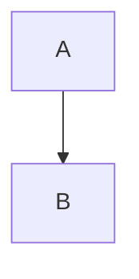

# 程式碼區塊轉換為 HTML

## 圍欄程式碼區塊 (無語言)

### Markdown

```
function test() {
  console.log("注意此函式前的空行嗎？");
}
```

### 剖析後的 HTML

```html
<pre><code>
function test() {
  console.log("注意此函式前的空行嗎？");
}
</code></pre>
```

---

## GitHub 秘訣註釋 (Tip Callout)

### Markdown

```md
> [!TIP]
> 若要在清單中保留您的格式，請務必將非圍欄程式碼區塊縮排八個空格。
```

### 剖析後的 HTML (GitHub 特有)

```html
<blockquote class="markdown-alert markdown-alert-tip">
  <p><strong>Tip</strong></p>
  <p>若要在清單中保留您的格式，請務必將非圍欄程式碼區塊縮排八個空格。</p>
</blockquote>
```

---

## 在程式碼區塊內顯示反引號

### Markdown

`````md
    ````
    ```
    看！您可以看到我的反引號。
    ```
    ````
`````

### 剖析後的 HTML

```html
    <pre><code>
    ```

    看！您可以看到我的反引號。

    ```
    </code></pre>
```

## 語法高亮 (語言識別碼)

### Markdown

```ruby
require 'redcarpet'
markdown = Redcarpet.new("Hello World!")
puts markdown.to_html
```

### 剖析後的 HTML

```html
<pre><code class="language-ruby">
require 'redcarpet'
markdown = Redcarpet.new("Hello World!")
puts markdown.to_html
</code></pre>
```

> `language-ruby` 類別由 GitHub 的語法高亮工具 (Linguist + grammar) 使用。

### 摘要：語法高亮規則 (HTML 層級)

| Markdown 圍欄 | 剖析後的 `<code>` 標籤         |
| ------------- | ------------------------------ |
| ```js         | `<code class="language-js">`   |
| ```html       | `<code class="language-html">` |
| ```md         | `<code class="language-md">`   |
| ``` (無語言)  | `<code>`                       |

---

## HTML 註解 (由渲染器忽略)

```md
<!-- 內部文件註解 -->
```

```html
<!-- 內部文件註解 -->
```

---

## 連結

```md
[關於在 GitHub 上編寫與格式化](https://docs.github.com/...)
```

```html
<a href="https://docs.github.com/...">關於在 GitHub 上編寫與格式化</a>
```

---

## 清單

```md
* [GitHub Flavored Markdown 規範](https://github.github.com/gfm/)
```

```html
<ul>
  <li>
    <a href="https://github.github.com/gfm/">GitHub Flavored Markdown 規範</a>
  </li>
</ul>
```

---

## 圖表 (概念性剖析)

### Markdown

````md

````

### 剖析後的 HTML

```html
<pre><code class="language-mermaid">
graph TD
  A --> B
</code></pre>
```

## 結語

* 這裡沒有出現 `language-*` 類別，因為**未提供語言識別碼**。
* 內部的三個反引號在 `<code>` 內部被保留為**字面文字**。
