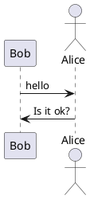
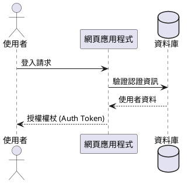
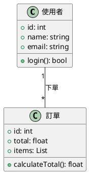
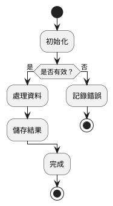
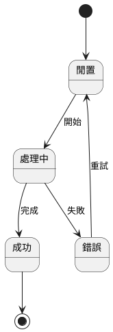
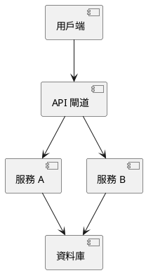
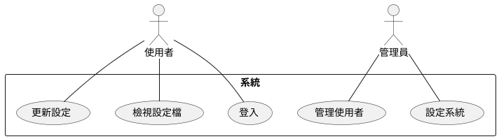
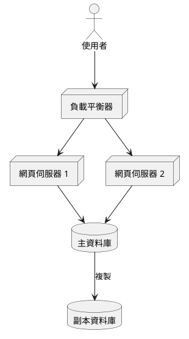

# PlantUML ASCII 藝術圖表產生器

## 概覽

使用 PlantUML 建立基於文字的 ASCII 藝術圖表。非常適合終端機環境中的文件、README 檔案、電子郵件，或任何不適合使用圖形化圖表的場景。

## 什麼是 PlantUML ASCII 藝術？

PlantUML 可以將圖表產生為純文字（ASCII 藝術）而非圖片。這對於以下情況非常有用：

- 基於終端機的工作流
- 不支援圖片的 Git 提交/提取請求 (PR)
- 需要進行版本控制的文件
- 無法使用圖形化工具的環境

## 安裝

```bash
# macOS
brew install plantuml

# Linux (因發行版而異)
sudo apt-get install plantuml  # Ubuntu/Debian
sudo yum install plantuml      # RHEL/CentOS

# 或直接下載 JAR 檔案
wget https://github.com/plantuml/plantuml/releases/download/v1.2024.0/plantuml-1.2024.0.jar
```

## 輸出格式

| 標籤    | 格式          | 描述                 |
| ------- | ------------- | -------------------- |
| `-txt`  | ASCII         | 純 ASCII 字元        |
| `-utxt` | Unicode ASCII | 使用方框繪製字元強化   |

## 基本工作流

### 1. 建立 PlantUML 圖表檔案



### 2. 產生 ASCII 藝術

```bash
# 標準 ASCII 輸出
plantuml -txt diagram.puml

# Unicode 強化輸出（外觀更佳）
plantuml -utxt diagram.puml

# 直接使用 JAR
java -jar plantuml.jar -txt diagram.puml
java -jar plantuml.jar -utxt diagram.puml
```

### 3. 檢視輸出

輸出結果會儲存為 `diagram.atxt` (ASCII) 或 `diagram.utxt` (Unicode)。

## 支援的圖表類型

### 時序圖 (Sequence Diagram)



### 類別圖 (Class Diagram)



### 活動圖 (Activity Diagram)



### 狀態圖 (State Diagram)



### 元件圖 (Component Diagram)



### 使用案例圖 (Use Case Diagram)



### 部署圖 (Deployment Diagram)



## 命令列選項

```bash
# 指定輸出目錄
plantuml -txt -o ./output diagram.puml

# 處理目錄中的所有檔案
plantuml -txt ./diagrams/

# 包含 dot 檔案（隱藏檔案）
plantuml -txt -includeDot diagrams/

# 詳細輸出
plantuml -txt -v diagram.puml

# 指定字元集
plantuml -txt -charset UTF-8 diagram.puml
```

## Ant 任務整合

```xml
<target name="generate-ascii">
  <plantuml dir="./src" format="txt" />
</target>

<target name="generate-unicode-ascii">
  <plantuml dir="./src" format="utxt" />
</target>
```

## 製作優質 ASCII 圖表的提示

1. **保持簡單**：複雜的圖表在 ASCII 中渲染效果不佳
2. **標籤簡短**：過長的文字會破壞 ASCII 對齊
3. **使用 Unicode (`-utxt`)**：使用方框繪製字元可獲得更好的視覺品質
4. **分享前測試**：在終端機中使用等寬字型驗證
5. **考慮替代方案**：對於複雜的圖表，請使用 Mermaid.js 或 Graphviz

## 範例輸出比較

**標準 ASCII (`-txt`)**：

```
     ,---.          ,---.
     |Bob|          |Alice|
     `---'          `---'
      |   hello      |
      |------------->|
      |              |
      |  Is it ok?   |
      |<-------------|
      |              |
```

**Unicode ASCII (`-utxt`)**：

```
┌─────┐        ┌─────┐
│ Bob │        │Alice│
└─────┘        └─────┘
  │   hello      │
  │─────────────>│
  │              │
  │  Is it ok?   │
  │<─────────────│
  │              │
```

## 快速參考

```bash
# 在 ASCII 中建立時序圖
cat > seq.puml << 'EOF'
@startuml
Alice -> Bob: Request
Bob --> Alice: Response
@enduml
EOF

plantuml -txt seq.puml
cat seq.atxt

# 使用 Unicode 建立
plantuml -utxt seq.puml
cat seq.utxt
```

## 疑難排解

**問題**：Unicode 字元亂碼

- **解決方案**：確保終端機支援 UTF-8 且具備正確的字型

**問題**：圖表看起來對齊不準

- **解決方案**：使用等寬字型（如 Courier、Monaco、Consolas）

**問題**：找不到命令

- **解決方案**：安裝 PlantUML 或直接使用 Java JAR 檔案

**問題**：未建立輸出檔案

- **解決方案**：檢查檔案權限，確保 PlantUML 具有寫入權限
