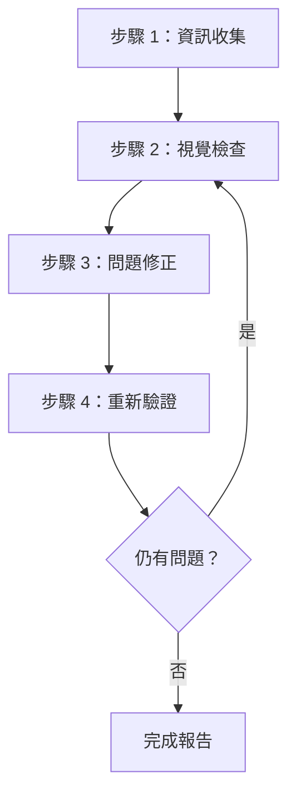
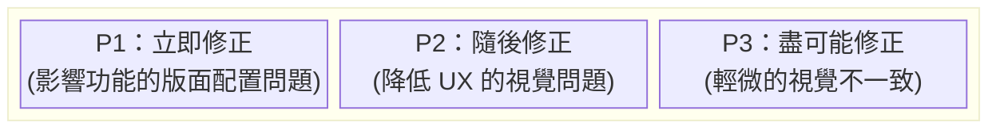
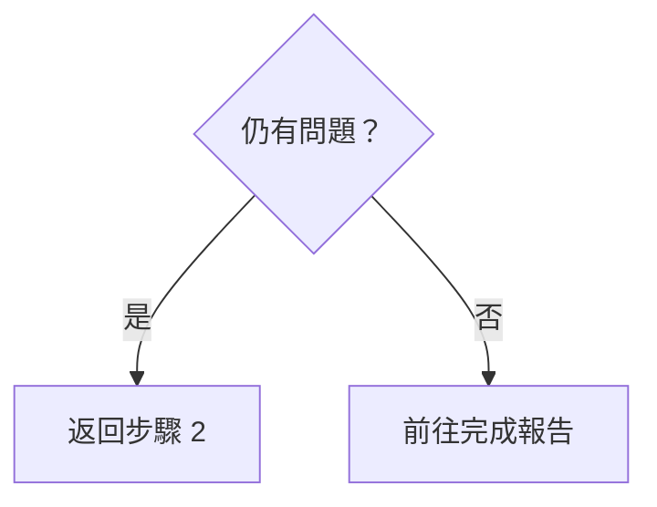

# 網頁設計審閱員 (Web Design Reviewer)

此技能可對網站設計品質進行視覺檢查與驗證，並在原始程式碼層級識別與修正問題。

## 適用範圍

- 靜態網站 (HTML/CSS/JS)
- SPA 框架，例如 React / Vue / Angular / Svelte
- 全端框架，例如 Next.js / Nuxt / SvelteKit
- CMS 平台，例如 WordPress / Drupal
- 任何其他網頁應用程式

## 先決條件

### 必要條件

1. **目標網站必須正在執行**
   - 本機開發伺服器 (例如 `http://localhost:3000`)
   - 預備 (Staging) 環境
   - 實際執行 (Production) 環境 (僅供唯讀審閱)

2. **必須具備瀏覽器自動化功能**
   - 螢幕截圖擷取
   - 頁面導覽
   - DOM 資訊獲取

3. **存取原始程式碼 (進行修正時)**
   - 專案必須存在於工作區內

## 工作流程總覽



---

## 步驟 1：資訊收集階段

### 1.1 URL 確認

如果未提供 URL，請詢問使用者：

> 請提供要審閱的網站 URL (例如 `http://localhost:3000`)

### 1.2 瞭解專案結構

進行修正時，請收集下列資訊：

| 項目 | 範例問題 |
|------|------------------|
| 框架 | 您是否使用 React / Vue / Next.js 等？ |
| 樣式方法 | CSS / SCSS / Tailwind / CSS-in-JS 等。 |
| 原始碼位置 | 樣式檔案和元件位於何處？ |
| 審閱範圍 | 僅限特定頁面還是整個網站？ |

### 1.3 自動專案偵測

嘗試從工作區中的檔案進行自動偵測：

```
偵測目標：
├── package.json     → 框架與相依性
├── tsconfig.json    → TypeScript 使用情況
├── tailwind.config  → Tailwind CSS
├── next.config      → Next.js
├── vite.config      → Vite
├── nuxt.config      → Nuxt
└── src/ 或 app/     → 原始碼目錄
```

### 1.4 識別樣式方法

| 方法 | 偵測方式 | 編輯目標 |
|--------|-----------|-------------|
| 純 CSS | `*.css` 檔案 | 全域 CSS 或元件 CSS |
| SCSS/Sass | `*.scss`, `*.sass` | SCSS 檔案 |
| CSS 模組 (CSS Modules) | `*.module.css` | 模組 CSS 檔案 |
| Tailwind CSS | `tailwind.config.*` | 元件中的 className |
| styled-components | 程式碼中的 `styled.` | JS/TS 檔案 |
| Emotion | `@emotion/` 引用 | JS/TS 檔案 |
| CSS-in-JS (其他) | 內嵌樣式 (Inline styles) | JS/TS 檔案 |

---

## 步驟 2：視覺檢查階段

### 2.1 頁面週遊 (Page Traversal)

1. 導覽至指定的 URL
2. 擷取螢幕截圖
3. 獲取 DOM 結構/快照 (如果可能)
4. 如果存在其他頁面，請透過導覽進行週遊

### 2.2 檢查項目

#### 版面配置問題

| 問題 | 說明 | 嚴重性 |
|-------|-------------|----------|
| 元件溢出 (Element Overflow) | 內容超出父元件或視埠 | 高 |
| 元件重疊 (Element Overlap) | 非預期的元件重疊 | 高 |
| 對齊問題 | Grid 或 Flex 對齊問題 | 中 |
| 間距不一致 | 邊距 (Padding/Margin) 不一致 | 中 |
| 文字遭截斷 | 未妥善處理長文字 | 中 |

#### 回應式問題

| 問題 | 說明 | 嚴重性 |
|-------|-------------|----------|
| 非行動裝置友善 | 版面在小螢幕上破裂 | 高 |
| 中斷點 (Breakpoint) 問題 | 螢幕尺寸變更時轉換不自然 | 中 |
| 觸控目標 | 行動裝置上的按鈕太小 | 中 |

#### 無障礙性問題

| 問題 | 說明 | 嚴重性 |
|-------|-------------|----------|
| 對比度不足 | 文字與背景之間的對比率過低 | 高 |
| 無焦點狀態 | 無法在鍵盤導覽期間確定狀態 | 高 |
| 缺少 alt 文字 | 圖片沒有替代文字 | 中 |

#### 視覺一致性

| 問題 | 說明 | 嚴重性 |
|-------|-------------|----------|
| 字體不一致 | 混合使用不同的字體系列 | 中 |
| 顏色不一致 | 品牌顏色未統一 | 中 |
| 間距不一致 | 相似元件之間的間距不統一 | 低 |

### 2.3 視埠測試 (回應式)

在下列視埠進行測試：

| 名稱 | 寬度 | 代表性裝置 |
|------|-------|----------------------|
| 行動裝置 | 375px | iPhone SE/12 mini |
| 平板電腦 | 768px | iPad |
| 桌上型電腦 | 1280px | 一般電腦 |
| 寬螢幕 | 1920px | 大型顯示器 |

---

## 步驟 3：問題修正階段

### 3.1 問題優先順序



### 3.2 識別原始檔案

從有問題的元件中識別原始檔案：

1. **基於選擇器 (Selector) 的搜尋**
   - 透過類別名稱 (Class name) 或 ID 搜尋程式碼庫
   - 使用 `grep_search` 探索樣式定義

2. **基於元件的搜尋**
   - 從元件文字或結構識別元件
   - 使用 `semantic_search` 探索相關檔案

3. **檔案模式篩選**
   ```
   樣式檔案：src/**/*.css, styles/**/*
   元件：src/components/**/*
   頁面：src/pages/**, app/**
   ```

### 3.3 套用修正

#### 框架特定修正指南

詳情請參閱 [references/framework-fixes.md](references/framework-fixes.md)。

#### 修正原則

1. **最小變更**：僅進行解決問題所需的最小必要變更
2. **尊重現有模式**：遵循專案中現有的程式碼風格
3. **避免破壞性變更**：注意不要影響其他區域
4. **加入註釋**：在適當處加入註釋以解釋修正原因

---

## 步驟 4：重新驗證階段

### 4.1 修正後確認

1. 重新載入瀏覽器 (或等待開發伺服器 HMR)
2. 擷取已修正區域的螢幕截圖
3. 比較修正前與修正後

### 4.2 迴歸測試

- 驗證修正是否影響了其他區域
- 確認回應式顯示未破裂

### 4.3 反覆運算決策



**反覆運算限制**：如果針對特定問題需要嘗試修正 3 次以上，請諮詢使用者

---

## 輸出格式

### 審閱結果報告

```markdown
# 網頁設計審閱結果

## 摘要

| 項目 | 數值 |
|------|-------|
| 目標 URL | {URL} |
| 框架 | {偵測到的框架} |
| 樣式 | {CSS / Tailwind / 等} |
| 測試視埠 | 桌上型電腦, 行動裝置 |
| 偵測到的問題 | {N} |
| 已修正的問題 | {M} |

## 偵測到的問題

### [P1] {問題標題}

- **頁面**：{頁面路徑}
- **元件**：{選擇器或說明}
- **問題**：{問題的詳細說明}
- **已修正檔案**：`{檔案路徑}`
- **修正詳情**：{變更說明}
- **螢幕截圖**：修正前/修正後

### [P2] {問題標題}
...

## 未修正問題 (如有)

### {問題標題}
- **原因**：{未修正/無法修正的原因}
- **建議操作**：{給使用者的建議}

## 建議

- {對未來改進的建議}
```

---

## 所需能力

| 能力 | 說明 | 必要性 |
|------------|-------------|----------|
| 網頁導覽 | 存取 URL、頁面切換 | ✅ |
| 螢幕截圖擷取 | 頁面影像擷取 | ✅ |
| 影像分析 | 視覺問題偵測 | ✅ |
| DOM 獲取 | 頁面結構獲取 | 建議 |
| 檔案讀取/寫入 | 原始程式碼讀取與編輯 | 修正時必要 |
| 程式碼搜尋 | 專案內的程式碼搜尋 | 修正時必要 |

---

## 參考實作

### 使用 Playwright MCP 實作

建議將 [Playwright MCP](https://github.com/microsoft/playwright-mcp) 作為此技能的參考實作。

| 能力 | Playwright MCP 工具 | 用途 |
|------------|---------------------|---------|
| 導覽 | `browser_navigate` | 存取 URL |
| 快照 | `browser_snapshot` | 獲取 DOM 結構 |
| 螢幕截圖 | `browser_take_screenshot` | 用於視覺檢查的影像 |
| 點擊 | `browser_click` | 與互動式元件互動 |
| 調整大小 | `browser_resize` | 回應式測試 |
| 控制台 | `browser_console_messages` | 偵測 JS 錯誤 |

#### 組態範例 (MCP 伺服器)

```json
{
  "mcpServers": {
    "playwright": {
      "command": "npx",
      "args": ["-y", "@playwright/mcp@latest", "--caps=vision"]
    }
  }
}
```

### 其他相容的瀏覽器自動化工具

| 工具 | 特點 |
|------|----------|
| Selenium | 廣泛的瀏覽器支援，多語言支援 |
| Puppeteer | 專注於 Chrome/Chromium，Node.js |
| Cypress | 易於與 E2E 測試整合 |
| WebDriver BiDi | 標準化的下一代協定 |

同樣的工作流程也可以使用這些工具實作。只要它們提供必要的能力 (導覽、螢幕截圖、DOM 獲取)，工具的選擇是靈活的。

---

## 最佳實務

### 建議做法 (DO)

- ✅ 在進行修正前，務必儲存螢幕截圖
- ✅ 一次修正一個問題並逐一驗證
- ✅ 遵循專案現有的程式碼風格
- ✅ 在進行重大變更前，先與使用者確認
- ✅ 詳盡記錄修正詳情

### 不建議做法 (DON'T)

- ❌ 未經確認進行大規模重構
- ❌ 忽略設計系統或品牌指南
- ❌ 忽略效能的修正
- ❌ 一次修正多個問題 (難以驗證)

---

## 疑難排解

### 問題：找不到樣式檔案

1. 檢查 `package.json` 中的相依性
2. 考慮使用 CSS-in-JS 的可能性
3. 考慮在建置時產生的 CSS
4. 詢問使用者樣式方法

### 問題：修正未反映出來

1. 檢查開發伺服器 HMR 是否運作正常
2. 清除瀏覽器快取
3. 如果專案需要建置，請重新建置
4. 檢查 CSS 特特性 (Specificity) 問題

### 問題：修正影響了其他區域

1. 復原變更
2. 使用更具體的選擇器
3. 考慮使用 CSS 模組或限定範圍 (scoped) 的樣式
4. 諮詢使用者以確認影響範圍
