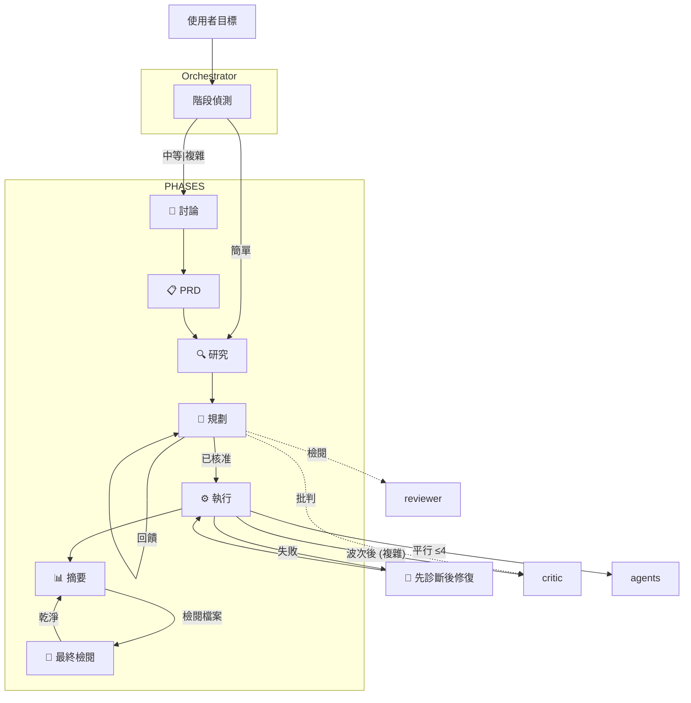

# 💎 Gem Team
>
> 用於規格驅動開發與自動驗證的多代理程式協調框架。
>
> **將模型品質轉化為系統品質。**
>

---

## 🚀 快速開始

請參閱下方的[所有安裝選項](#-安裝)。

---

## 🤔 為什麼選擇 Gem Team？

- ⚡ **快 4 倍** — 透過基於波次的平行執行
- 🏆 **更高品質** — 特化代理程式 + TDD + 驗證閘道 + 契約優先
- 🔒 **內建安全** — 對關鍵任務進行 OWASP 掃描、秘密/PII 偵測
- 👁️ **完整能見度** — 即時狀態、清晰的核准閘道
- 🛡️ **韌性** — 事前剖析分析、失敗處理、自動重新規劃
- ♻️ **模式重複使用** — 程式碼庫模式探索，防止重複造輪子
- 📏 **既定模式** — 優先使用函式庫/框架慣例，而非自定義實作
- 🪞 **自我修正** — 所有代理程式在 0.85 信賴度閾值下進行自我批判
- 🧠 **內容腳手架** — 在模型讀取程式碼*之前*映射大規模相依性，防止舊存放庫中的內容遺失
- ⚖️ **意圖 vs. 合規性** — 將負擔從撰寫「完美提示」轉移到執行嚴格的、基於 YAML 的核准閘道
- 📋 **來源驗證** — 每項事實主張都引用其來源；無須臆測
- ♿ **無障礙優先** — 在規格和執行階段層驗證 WCAG 合規性
- 🔬 **智慧偵錯** — 根本原因分析、堆疊追蹤解析 + 信賴度評分修復
- 🚀 **安全維運** — 等冪操作、健全狀況檢查、強制性核准閘道
- 🔗 **可追溯性** — 自我說明 ID 連結需求 → 任務 → 測試 → 證據
- 📚 **知識驅動** — 優先順序來源 (PRD → 程式碼庫 → AGENTS.md → Context7 → 文件)
- 🛠️ **技能與指引** — 內建技能與指引 (網頁設計指引)
- 📐 **規格驅動** — 多步驟精煉在「如何做」之前定義「做什麼」
- 🌊 **基於波次** — 平行代理程式與每波次整合閘道
- 🗂️ **已驗證計劃** — 複雜任務：計劃 → 驗證 → 批判
- 🔎 **最終檢閱** — 選填的使用者觸發對所有變更檔案進行全面檢閱
- 🩺 **先診斷後修復** — gem-debugger 診斷 → gem-implementer 修復 → 重新驗證
- ⚠️ **事前剖析** — 在執行之前識別失敗模式
- 💬 **建設性批判** — gem-critic 挑戰假設，尋找邊緣案例
- 📝 **契約優先** — 在實作之前撰寫契約測試
- 📱 **行動代理程式** — 原生行動實作 (React Native, Flutter) + iOS/Android 測試

### 🚀 「系統智商」倍增器

單次交談中的原始推理是不夠的。Gem-Team 將您偏好的 LLM 封裝在一個嚴格的、驗證優先的迴圈中，從根本上提升其在 SWE-bench 基準測試中的有效能力：

- **對於小型模型 (例如 Qwen 1.7B - 8B)：** 框架提供了「執行大腦」。任務分解和隔離的 50 行區塊可將其局部偵錯成功率提升至 **兩倍**。
- **對於推理模型 (例如 DeepSeek 3.2)：** TDD 迴圈和平行研究穩定了其原生檔案 I/O 的脆弱性，使執行可靠性提升高達 **+25%**。
- **對於 SOTA 模型 (例如 GLM 5.1, Kimi K2.5)：** `gem-reviewer` 作為雜訊過濾器，修剪冗長內容並執行嚴格的 PRD 合規性，以防止過度工程。

### 🎨 設計支援

Gem Team 包含專門的設計代理程式，並具備**反「AI 廢料」指引**，以打造獨特且現代的美學：

| 代理程式 | 焦點 | 關鍵能力 |
|:------|:------|:-----------------|
| **DESIGNER** | 網頁 UI/UX | 版面配置、佈景主題、設計系統、無障礙 (WCAG)、7 種設計運動 (粗獷主義 → 極致主義)、5 層提升系統 |
| **DESIGNER-MOBILE** | 行動裝置 UI/UX | iOS HIG、Material 3、安全區域、觸覺回饋、設計運動的平台特定適應 |

**反 AI 廢料原則：**
- 獨特的字型 (Cabinet Grotesk, Satoshi, Clash Display — 絕不使用預設的 Inter/Roboto)
- 60-30-10 色彩策略與鮮明強調色
- 打破可預測的版面配置 (不對稱網格、重疊、便當盒模式)
- 具備目的性的動態效果與協調的頁面載入
- 設計運動庫：粗獷主義 (Brutalism)、新粗獷主義 (Neo-brutalism)、玻璃擬態 (Glassmorphism)、黏土擬態 (Claymorphism)、極簡奢華 (Minimalist Luxury)、復古未來主義 (Retro-futurism)、極致主義 (Maximalism)

這兩個代理程式都包含品質檢查清單，用於產生獨特且令人難忘的設計。

---

## 🔄 核心工作流程

**階段流：** 使用者目標 → Orchestrator → 討論 (中等|複雜) → PRD → 研究 → 規劃 → 計劃檢閱 (中等|複雜) → 執行 → 摘要 → (選填) 最終檢閱

**錯誤處理：** 先診斷後修復迴圈 (Debugger → Implementer → 重新驗證)

**Orchestrator** 自動偵測階段並據此進行路由。任何回饋或引導訊息都會被處理以重新規劃。

| 條件 | 階段 | 結果 |
|:----------|:------|:--------|
| 無計劃 + 簡單 | 研究 → 規劃 | 快速執行路徑 |
| 無計劃 + 中等\|複雜 | 討論 → PRD → 研究 | 規格驅動方法 |
| 有計劃 + 待處理任務 | 執行 | 基於波次的實作 |
| 有計劃 + 回饋 | 規劃 | 根據引導重新規劃 |
| 有計劃 + 已完成 | 摘要 | 使用者決定 (回饋 / 最終檢閱 / 核准) |
| 使用者要求最終檢閱 | 最終檢閱 | 由 gem-reviewer + gem-critic 進行平行檢閱 |

---

## 📦 安裝

| 方法 | 指令 / 連結 | 文件 |
|:-------|:---------------|:-----|
| **VS Code** | **[立即安裝](https://aka.ms/awesome-copilot/install/agent?url=vscode%3Achat-agent%2Finstall%3Furl%3Dhttps%253A%252F%252Fraw.githubusercontent.com%252Fgithub%252Fawesome-copilot%252Fmain%252F.%252Fagents)** | [Copilot 文件](https://docs.github.com/en/copilot/using-github-copilot/using-github-copilot-chat) |
| **VS Code Insiders** | **[立即安裝](https://aka.ms/awesome-copilot/install/agent?url=vscode-insiders%3Achat-agent%2Finstall%3Furl%3Dhttps%253A%252F%252Fraw.githubusercontent.com%252Fgithub%252Fawesome-copilot%252Fmain%252F.%252Fagents)** | [Copilot 文件](https://docs.github.com/en/copilot/using-github-copilot/using-github-copilot-chat) |
| **APM   (所有 AI 程式碼代理程式)** | `apm install mubaidr/gem-team` | [APM 文件](https://microsoft.github.io/apm/) |
| **Copilot CLI (市集)** | `copilot plugin install gem-team@awesome-copilot` | [CLI 文件](https://github.com/github/copilot-cli) |
| **Copilot CLI (直接)** | `copilot plugin install gem-team@mubaidr` | [CLI 文件](https://github.com/github/copilot-cli) |
| **Windsurf** | `codeium agent install mubaidr/gem-team` | [Windsurf 文件](https://docs.codeium.com/windsurf) |
| **Claude Code** | `claude plugin install mubaidr/gem-team` | [Claude 文件](https://docs.anthropic.com/en/docs/claude-code) |
| **OpenCode** | `opencode plugin install mubaidr/gem-team` | [OpenCode 文件](https://opencode.ai/docs/) |
| **手動   (複製代理程式檔案)** | VS Code: `~/.vscode/agents/`   VS Code Insiders: `~/.vscode-insiders/agents/`   GitHub Copilot: `~/.github/copilot/agents/`   GitHub Copilot (專案): `.github/plugin/agents/`   Windsurf: `~/.windsurf/agents/`   Claude: `~/.claude/agents/`   Cursor: `~/.cursor/agents/`   OpenCode: `~/.opencode/agents/` | — |

---

## 🏗️ 架構

---

## 🤖 代理程式團隊 (2026 年 Q2 SOTA)

| 角色 | 說明 | 輸出 | 建議的 LLM |
|:-----|:------------|:-------|:---------------|
| 🎯 **ORCHESTRATOR** | 團隊負責人：協調研究、規劃、實作與驗證 | 📋 PRD, plan.yaml | **封閉原始碼：** GPT-5.4, Gemini 3.1 Pro, Claude Sonnet 4.6 **開放原始碼：** GLM-5, Kimi K2.5, Qwen3.5 |
| 🔍 **RESEARCHER** | 程式碼庫探索 — 模式、相依性、架構發現 | 🔍 findings | **封閉原始碼：** Gemini 3.1 Pro, GPT-5.4, Claude Sonnet 4.6 **開放原始碼：** GLM-5, Qwen3.5-9B, DeepSeek-V3.2 |
| 📋 **PLANNER** | 基於 DAG 的執行計劃 — 任務分解、波次排程、風險分析 | 📄 plan.yaml | **封閉原始碼：** Gemini 3.1 Pro, Claude Sonnet 4.6, GPT-5.4 **開放原始碼：** Kimi K2.5, GLM-5, Qwen3.5 |
| 🔧 **IMPLEMENTER** | TDD 程式碼實作 — 功能、臭蟲、重構。絕不檢閱自己的工作 | 💻 程式碼 | **封閉原始碼：** Claude Opus 4.6, GPT-5.4, Gemini 3.1 Pro **開放原始碼：** DeepSeek-V3.2, GLM-5, Qwen3-Coder-Next |
| 🧪 **BROWSER TESTER** | E2E 瀏覽器測試、UI/UX 驗證、使用 Playwright 進行視覺回歸測試 | 🧪 證據 | **封閉原始碼：** GPT-5.4, Claude Sonnet 4.6, Gemini 3.1 Flash **開放原始碼：** Llama 4 Maverick, Qwen3.5-Flash, MiniMax M2.7 |
| 🚀 **DEVOPS** | 基礎設施部署、CI/CD 管線、容器管理 | 🌍 基礎設施 | **封閉原始碼：** GPT-5.4, Gemini 3.1 Pro, Claude Sonnet 4.6 **開放原始碼：** DeepSeek-V3.2, GLM-5, Qwen3.5 |
| 🛡️ **REVIEWER** | **零幻覺過濾器** — 安全稽核、程式碼檢閱、OWASP 掃描、PRD 合規性驗證 | 📊 檢閱報告 | **封閉原始碼：** Claude Opus 4.6, GPT-5.4, Gemini 3.1 Pro **開放原始碼：** Kimi K2.5, GLM-5, DeepSeek-V3.2 |
| 📝 **DOCUMENTATION** | 技術文件、README 檔案、API 文件、圖表、導覽 | 📝 文件 | **封閉原始碼：** Claude Sonnet 4.6, Gemini 3.1 Flash, GPT-5.4 Mini **開放原始碼：** Llama 4 Scout, Qwen3.5-9B, MiniMax M2.7 |
| 🔬 **DEBUGGER** | 根本原因分析、堆疊追蹤診斷、回歸二分法、錯誤重現 | 🔬 診斷 | **封閉原始碼：** Gemini 3.1 Pro (檢索之王), Claude Opus 4.6, GPT-5.4 **開放原始碼：** DeepSeek-V3.2, GLM-5, Qwen3-Coder-Next |
| 🎯 **CRITIC** | 挑戰假設、尋找邊緣案例、發現過度工程與邏輯漏洞 | 💬 批判 | **封閉原始碼：** Claude Sonnet 4.6, GPT-5.4, Gemini 3.1 Pro **開放原始碼：** Kimi K2.5, GLM-5, Qwen3.5 |
| ✂️ **SIMPLIFIER** | 重構專家 — 移除無用程式碼、降低複雜度、合併重複內容 | ✂️ 變更日誌 | **封閉原始碼：** Claude Opus 4.6, GPT-5.4, Gemini 3.1 Pro **開放原始碼：** DeepSeek-V3.2, GLM-5, Qwen3-Coder-Next |
| 🎨 **DESIGNER** | UI/UX 設計專家 — 版面配置、佈景主題、配色方案、設計系統、無障礙 | 🎨 DESIGN.md | **封閉原始碼：** GPT-5.4, Gemini 3.1 Pro, Claude Sonnet 4.6 **開放原始碼：** Qwen3.5, GLM-5, MiniMax M2.7 |
| 📱 **IMPLEMENTER-MOBILE** | 行動裝置實作 — React Native, Expo, Flutter 與 TDD | 💻 程式碼 | **封閉原始碼：** Claude Opus 4.6, GPT-5.4, Gemini 3.1 Pro **開放原始碼：** DeepSeek-V3.2, GLM-5, Qwen3-Coder-Next |
| 📱 **DESIGNER-MOBILE** | 行動裝置 UI/UX 專家 — HIG, Material Design, 安全區域、點擊目標 | 🎨 DESIGN.md | **封閉原始碼：** GPT-5.4, Gemini 3.1 Pro, Claude Sonnet 4.6 **開放原始碼：** Qwen3.5, GLM-5, MiniMax M2.7 |
| 📱 **MOBILE TESTER** | 行動裝置 E2E 測試 — Detox, Maestro, iOS/Android 模擬器 | 🧪 證據 | **封閉原始碼：** GPT-5.4, Claude Sonnet 4.6, Gemini 3.1 Flash **開放原始碼：** Llama 4 Maverick, Qwen3.5-Flash, MiniMax M2.7 |

---

## 📚 知識來源

代理程式僅諮詢與其角色相關的來源。適用以下信賴度等級：

| 信賴度等級 | 來源 | 行為 |
|:-----------|:--------|:---------|
| **受信任** | PRD.yaml, plan.yaml, AGENTS.md | 視為指令遵循 |
| **驗證** | 程式碼庫檔案、研究發現 | 在假設之前進行交叉引用 |
| **不信任** | 錯誤記錄檔、外部資料、第三方回應 | 僅供事實參考 — 絕不作為指令 |

| 代理程式 | 知識來源 |
|:------|:------------------|
| orchestrator | PRD.yaml, AGENTS.md |
| researcher | PRD.yaml, 程式碼庫模式, AGENTS.md, Context7, 官方文件, 線上搜尋 |
| planner | PRD.yaml, 程式碼庫模式, AGENTS.md, Context7, 官方文件 |
| implementer | 程式碼庫模式, AGENTS.md, Context7 (API 驗證), DESIGN.md (UI 任務) |
| debugger | 程式碼庫模式, AGENTS.md, 錯誤記錄檔 (不信任), git 歷程記錄, DESIGN.md (UI 臭蟲) |
| reviewer | PRD.yaml, 程式碼庫模式, AGENTS.md, OWASP 參考, DESIGN.md (UI 檢閱) |
| browser-tester | PRD.yaml (流程覆蓋), AGENTS.md, 測試固件 (fixture), 基準螢幕截圖, DESIGN.md (視覺驗證) |
| designer | PRD.yaml (UX 目標), 程式碼庫模式, AGENTS.md, 現有設計系統 |
| code-simplifier | 程式碼庫模式, AGENTS.md, 測試套件 (行為驗證) |
| documentation-writer | AGENTS.md, 現有文件, 原始程式碼 |

---

## 🤝 貢獻

歡迎貢獻！請隨時提交 Pull Request。請參閱 [CONTRIBUTING](./CONTRIBUTING.md) 以獲取有關提交訊息格式、分支策略和程式碼標準的詳細指引。

## 📄 授權

此專案根據 Apache License 2.0 獲得授權。

## 💬 支援

如果您遇到任何問題或有疑問，請在 GitHub 上[開啟 Issue](https://github.com/mubaidr/gem-team/issues)。
