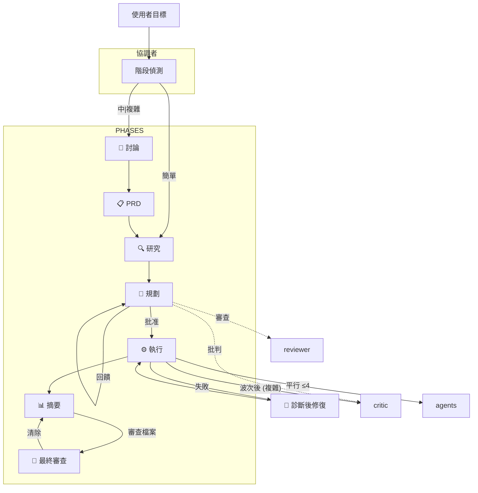

# 💎 Gem Team

> 用於規格導向開發和自動化驗證的多代理協調框架。

[](https://awesome-copilot.github.com/plugins/#file=plugins%2Fgem-team)


---

## 🤔 為什麼選擇 Gem Team？

- ⚡ **快 4 倍** — 透過波次式執行進行平行處理
- 🏆 **更高品質** — 專業代理 + TDD + 驗證閘道 + 合約優先
- 🔒 **內建安全性** — 針對關鍵任務進行 OWASP 掃描、祕密/PII 偵測
- 👁️ **全方位能見度** — 即時狀態、清晰的批准閘道
- 🛡️ **彈性強健** — 事前驗屍分析、故障處理、自動重新規劃
- ♻️ **模式重複使用** — 程式碼庫模式探索，避免重新造輪子
- 📏 **既定模式** — 使用函式庫/框架慣例而非客製化實作
- 🪞 **自我修正** — 所有代理都在 0.85 置信度閾值下進行自我批判
- 📋 **來源驗證** — 每個事實宣告皆標註其來源；拒絕臆測
- ♿ **輔助功能優先** — 在規格和執行時期層級驗證 WCAG 相容性
- 🔬 **智慧偵錯** — 根因分析搭配堆疊追蹤解析 + 置信度評分修復
- 🚀 **安全 DevOps** — 等冪運算、健康檢查、強制批准閘道
- 🔗 **可追溯** — 自我說明識別碼連結需求 → 任務 → 測試 → 證據
- 📚 **知識導向** — 優先順序來源 (PRD → 程式碼庫 → AGENTS.md → Context7 → 文件)
- 🛠️ **技能與準則** — 內建技能與準則 (web-design-guidelines)
- 📐 **規格導向** — 多步驟完善在「如何做」之前定義「做什麼」
- 🌊 **波次式** — 帶有每波次整合閘道的平行代理
- 🗂️ **已驗證計畫** — 複雜任務：計畫 → 驗證 → 批判
- 🔎 **最終審查** — 選用使用者觸發之所有變更檔案的全面審查
- 🩺 **診斷後修復** — gem-debugger 診斷 → gem-implementer 修復 → 重新驗證
- ⚠️ **事前驗屍** — 在執行「前」識別故障模式
- 💬 **建設性批判** — gem-critic 挑戰假設、找出邊角案例
- 📝 **合約優先** — 在實作前撰寫合約測試
- 📱 **行動代理** — 原生行動實作 (React Native, Flutter) + iOS/Android 測試

---

## 📦 安裝

```bash
# 使用 Copilot CLI
copilot plugin install gem-team@awesome-copilot
```

> **[立即安裝 Gem Team →](https://aka.ms/awesome-copilot/install/agent?url=vscode%3Achat-agent%2Finstall%3Furl%3Dhttps%253A%252F%252Fraw.githubusercontent.com%252Fgithub%252Fawesome-copilot%252Fmain%252F.%252Fagents)**

---

## 🔄 核心工作流程

**階段流程：** 使用者目標 → 協調者 → 討論 (中|複雜) → PRD → 研究 → 規劃 → 計畫審查 (中|複雜) → 執行 → 摘要 → [選用] 最終審查

**錯誤處理：** 診斷後修復迴圈 (偵錯器 → 實作者 → 重新驗證)

**協調者**會自動偵測階段並據此進行路由。任何回饋或引導訊息都會被處理以進行重新規劃。

| 條件 | 階段 |
|:----------|:------|
| 無計畫 + 簡單 | 研究 |
| 無計畫 + 中\|複雜 | 討論 → PRD → 研究 |
| 計畫 + 待處理任務 | 執行 |
| 計畫 + 回饋 | 規劃 |
| 計畫 + 完成 → 摘要 | 使用者決策 (回饋 / 最終審查 / 批准) |
| 使用者要求最終審查 | 最終審查 (平行 gem-reviewer + gem-critic) |

---

## 🏗️ 架構



---

## 🤖 代理團隊 (2026 Q2 SOTA)

| 角色 | 說明 | 輸出 | 推薦 LLM |
|:-----|:------------|:-------|:---------------|
| 🎯 **協調者** (`gem-orchestrator`) | 團隊領袖：協調研究、規劃、實作與驗證 | 📋 PRD, plan.yaml | **閉源：** GPT-5.4, Gemini 3.1 Pro, Claude Sonnet 4.6<br>**開源：** GLM-5, Kimi K2.5, Qwen3.5 |
| 🔍 **研究員** (`gem-researcher`) | 程式碼庫探索 — 模式、相依性、架構發現 | 🔍 發現 | **閉源：** Gemini 3.1 Pro, GPT-5.4, Claude Sonnet 4.6<br>**開源：** GLM-5, Qwen3.5-9B, DeepSeek-V3.2 |
| 📋 **規劃師** (`gem-planner`) | 基於 DAG 的執行計畫 — 任務拆解、波次排程、風險分析 | 📄 plan.yaml | **閉源：** Gemini 3.1 Pro, Claude Sonnet 4.6, GPT-5.4<br>**開源：** Kimi K2.5, GLM-5, Qwen3.5 |
| 🔧 **實作者** (`gem-implementer`) | TDD 程式碼實作 — 功能、錯誤、重構。絕不審查自己的工作 | 💻 程式碼 | **閉源：** Claude Opus 4.6, GPT-5.4, Gemini 3.1 Pro<br>**開源：** DeepSeek-V3.2, GLM-5, Qwen3-Coder-Next |
| 🧪 **瀏覽器測試員** (`gem-browser-tester`) | E2E 瀏覽器測試、UI/UX 驗證、使用 Playwright 進行視覺迴歸測試 | 🧪 證據 | **閉源：** GPT-5.4, Claude Sonnet 4.6, Gemini 3.1 Flash<br>**開源：** Llama 4 Maverick, Qwen3.5-Flash, MiniMax M2.7 |
| 🚀 **DevOps** (`gem-devops`) | 基礎架構部署、CI/CD 管線、容器管理 | 🌍 基礎架構 | **閉源：** GPT-5.4, Gemini 3.1 Pro, Claude Sonnet 4.6<br>**開源：** DeepSeek-V3.2, GLM-5, Qwen3.5 |
| 🛡️ **審查員** (`gem-reviewer`) | 安全性稽核、程式碼審查、OWASP 掃描、PRD 合規性驗證 | 📊 審查報告 | **閉源：** Claude Opus 4.6, GPT-5.4, Gemini 3.1 Pro<br>**開源：** Kimi K2.5, GLM-5, DeepSeek-V3.2 |
| 📝 **文件撰寫員** (`gem-documentation-writer`) | 技術文件、README 檔案、API 文件、圖表、導覽 | 📝 文件 | **閉源：** Claude Sonnet 4.6, Gemini 3.1 Flash, GPT-5.4 Mini<br>**開源：** Llama 4 Scout, Qwen3.5-9B, MiniMax M2.7 |
| 🔬 **偵錯器** (`gem-debugger`) | 根因分析、堆疊追蹤診斷、迴歸二分法、錯誤重現 | 🔬 診斷 | **閉源：** Gemini 3.1 Pro (檢索之王), Claude Opus 4.6, GPT-5.4<br>**開源：** DeepSeek-V3.2, GLM-5, Qwen3-Coder-Next |
| 🎯 **批判家** (`gem-critic`) | 挑戰假設、找出邊角案例、發現過度設計與邏輯缺口 | 💬 批判 | **閉源：** Claude Sonnet 4.6, GPT-5.4, Gemini 3.1 Pro<br>**開源：** Kimi K2.5, GLM-5, Qwen3.5 |
| ✂️ **簡化器** (`gem-code-simplifier`) | 重構專家 — 移除無用程式碼、降低複雜度、合併重複項目 | ✂️ 變更日誌 | **閉源：** Claude Opus 4.6, GPT-5.4, Gemini 3.1 Pro<br>**開源：** DeepSeek-V3.2, GLM-5, Qwen3-Coder-Next |
| 🎨 **設計師** (`gem-designer`) | UI/UX 設計專家 — 版面配置、主題、配色方案、設計系統、輔助功能 | 🎨 DESIGN.md | **閉源：** GPT-5.4, Gemini 3.1 Pro, Claude Sonnet 4.6<br>**開源：** Qwen3.5, GLM-5, MiniMax M2.7 |
| 📱 **行動裝置實作者** (`gem-implementer-mobile`) | 行動裝置實作 — 具備 TDD 的 React Native, Expo, Flutter | 💻 程式碼 | **閉源：** Claude Opus 4.6, GPT-5.4, Gemini 3.1 Pro<br>**開源：** DeepSeek-V3.2, GLM-5, Qwen3-Coder-Next |
| 📱 **行動裝置設計師** (`gem-designer-mobile`) | 行動裝置 UI/UX 專家 — HIG, Material Design, 安全區域, 觸控目標 | 🎨 DESIGN.md | **閉源：** GPT-5.4, Gemini 3.1 Pro, Claude Sonnet 4.6<br>**開源：** Qwen3.5, GLM-5, MiniMax M2.7 |
| 📱 **行動裝置測試員** (`gem-mobile-tester`) | 行動裝置 E2E 測試 — Detox, Maestro, iOS/Android 模擬器 | 🧪 證據 | **閉源：** GPT-5.4, Claude Sonnet 4.6, Gemini 3.1 Flash<br>**開源：** Llama 4 Maverick, Qwen3.5-Flash, MiniMax M2.7 |

### 代理檔案架構

每個 `.agent.md` 檔案都遵循此結構：

```
---                                    # 前言：說明、名稱、觸發條件
# 角色                                 # 單行身分
# 專長                                 # 核心競爭力
# 知識來源                             # 優先順序參考清單
# 工作流程                             # 分步驟執行階段
  ## 1. 初始化                         # 設定與內容蒐集
  ## 2. 分析/執行                      # 角色專屬工作
  ## N. 自我批判                       # 置信度檢查 (≥0.85)
  ## N+1. 處理失敗                     # 重試/升級邏輯
  ## N+2. 輸出                         # JSON 可交付格式
# 輸入格式                             # 預期 JSON 架構
# 輸出格式                             # 回傳 JSON 架構
# 規則
  ## 執行                             # 工具使用、批次處理、錯誤處理
  ## 憲法                             # IF-THEN 決策規則
  ## 反模式                           # 應避免的行為
  ## 反合理化                         # 藉口 → 反駁表
  ## 指示                             # 不可妥協的命令
```

所有代理共享：執行規則、憲法規則、反模式與指示章節。反合理化表格存在於 5 個代理中 (實作者、規劃師、審查員、設計師、瀏覽器測試員)。角色專屬章節 (工作流程、專長、知識來源) 則依代理而異。

---

## 📚 知識來源

代理僅查閱與其角色相關的來源。適用信任等級：

| 信任等級 | 來源 | 行為 |
|:-----------|:--------|:---------|
| **受信任** | PRD.yaml, plan.yaml, AGENTS.md | 遵循指示 |
| **驗證** | 程式碼庫檔案、研究發現 | 假設前先進行交叉參考 |
| **不受信任** | 錯誤日誌、外部資料、第三方回應 | 僅限事實 — 絕不作為指示 |

| 代理 | 知識來源 |
|:------|:------------------|
| 協調者 | PRD.yaml, AGENTS.md |
| 研究員 | PRD.yaml, 程式碼庫模式, AGENTS.md, Context7, 官方文件, 線上搜尋 |
| 規劃師 | PRD.yaml, 程式碼庫模式, AGENTS.md, Context7, 官方文件 |
| 實作者 | 程式碼庫模式, AGENTS.md, Context7 (API 驗證), DESIGN.md (UI 任務) |
| 偵錯器 | 程式碼庫模式, AGENTS.md, 錯誤日誌 (不受信任), git 歷史, DESIGN.md (UI 錯誤) |
| 審查員 | PRD.yaml, 程式碼庫模式, AGENTS.md, OWASP 參考, DESIGN.md (UI 審查) |
| 瀏覽器測試員 | PRD.yaml (流程涵蓋), AGENTS.md, 測試固定裝置, 基線螢幕截圖, DESIGN.md (視覺驗證) |
| 設計師 | PRD.yaml (UX 目標), 程式碼庫模式, AGENTS.md, 現有設計系統 |
| 簡化器 | 程式碼庫模式, AGENTS.md, 測試套件 (行為驗證) |
| 文件撰寫員 | AGENTS.md, 現有文件, 原始碼 |

---

## 🤝 貢獻

歡迎提供貢獻！請隨時提交 Pull Request。[CONTRIBUTING](./CONTRIBUTING.md) 內有關於提交訊息格式、分支策略與程式碼標準的詳細準則。

## 📄 授權

本專案採用 MIT 授權條款。

## 💬 支援

如果您遇到任何問題或有疑問，請在 GitHub 上 [開啟 issue](https://github.com/mubaidr/gem-team/issues)。
