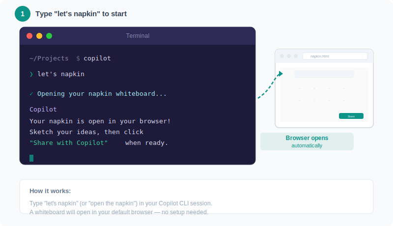
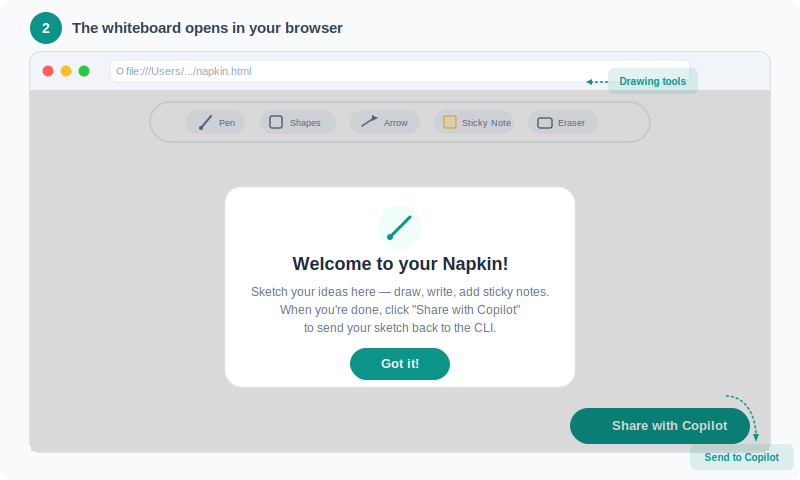

# Napkin — Copilot CLI 的視覺化白板

在您的瀏覽器中開啟並連接到 Copilot CLI 的白板。繪製、素描、新增便利貼 — 然後將所有內容分享回 Copilot。Copilot 會查看您的繪圖並提供分析、建議和想法。

專為非軟體開發人員打造：律師、專案經理 (PM)、業務關係人、設計師、作家 — 任何更喜歡以視覺化方式思考的人。

## 安裝

直接從 Copilot CLI 安裝外掛程式：

```bash
copilot plugin install napkin@awesome-copilot
```

就這樣。不需要其他軟體、帳號或設定。

### 驗證是否已安裝

在 Copilot CLI 中執行此指令以確認外掛程式可用：

```
/skills
```

您應該會在可用技能清單中看到 **napkin**。

## 如何使用

### 第 1 步：說「let's napkin」

開啟 Copilot CLI 並輸入 `let's napkin`（或「open a napkin」或「start a whiteboard」）。Copilot 會建立一個白板並在您的瀏覽器中開啟它。



### 第 2 步：您的白板已開啟

瀏覽器中會出現一個乾淨的白板，並附有簡單的繪圖工具。如果是第一次使用，會有簡短的歡迎訊息說明運作方式。



### 第 3 步：繪圖與腦力激盪

使用工具素描想法、新增便利貼、在概念之間畫箭頭 — 任何有助於您思考的方式。這是您的空間。


### 第 4 步：與 Copilot 分享

當您準備好聽取 Copilot 的意見時，請點擊綠色的 **Share with Copilot** 按鈕。它會儲存螢幕截圖並複製您的筆記。


### 第 5 步：Copilot 回應

回到您的終端機並說「check the napkin」。Copilot 會查看您的白板 — 包括您的繪圖 — 並做出回應。


## 內容包含

### 技能

| 技能     | 說明                                                            |
| -------- | --------------------------------------------------------------- |
| `napkin` | 視覺化白板協作 — 建立白板、解讀您的繪圖和筆記，並以對話方式回應 |

### 隨附資產

| 資產                 | 說明                                                          |
| -------------------- | ------------------------------------------------------------- |
| `assets/napkin.html` | 白板應用程式 — 可在任何瀏覽器中開啟的單一 HTML 檔案，無需安裝 |

## 白板功能

| 功能                | 說明                                                             |
| ------------------- | ---------------------------------------------------------------- |
| **手繪**            | 使用筆刷工具繪圖，就像在紙上一樣                                 |
| **形狀**            | 矩形、圓形、直線和箭頭 — 歪斜的形狀會自動修正為整齊的版本        |
| **便利貼**          | 可拖曳、調整大小、具備顏色標記的筆記（黃色、粉紅色、藍色、綠色） |
| **文字標籤**        | 點擊任何地方直接在畫布上輸入文字                                 |
| **平移與縮放**      | 按住空格鍵並拖曳即可移動；滾動即可縮放                           |
| **復原/重做**       | 弄錯了？Ctrl+Z 復原，Ctrl+Shift+Z 重做                           |
| **自動儲存**        | 您的工作會自動儲存 — 關閉分頁，稍後回來，內容仍然存在            |
| **與 Copilot 分享** | 一鍵匯出螢幕截圖並複製您的文字內容                               |

## Copilot 如何理解您的繪圖

當您點擊「Share with Copilot」時，會發生兩件事：

1. **儲存螢幕截圖**（在您的下載或桌面資料夾中的 `napkin-snapshot.png`）。Copilot 會讀取此圖像，並可以看到所有內容 — 素描、箭頭、分組、註釋、便利貼、空間佈局。

2. **您的文字已複製到剪貼簿。** 這讓 Copilot 獲得便利貼和標籤中的精確文字，因此不會誤讀圖像內容。

Copilot 同時利用這兩者來理解您的想法，並像協作者一樣做出回應 — 不是分析資料的電腦，而是看著您白板草圖的同事。

## 您可以繪製什麼？

任何內容。但這裡有一些 Copilot 特別擅長解讀的內容：

| 您繪製的內容     | Copilot 理解的內容         |
| ---------------- | -------------------------- |
| 由箭頭連接的方塊 | 程序流或工作流程           |
| 被圈在一起的項目 | 一組相關的想法             |
| 不同顏色的便利貼 | 類別或優先順序             |
| 劃掉的文字       | 被拒絕或降低優先順序的內容 |
| 星號或驚嘆號     | 高優先順序項目             |
| 位於對立側的項目 | 比較或對照                 |
| 簡略的組織圖     | 匯報結構或團隊佈局         |

## 鍵盤快速鍵

您不需要這些 — 所有功能都可以透過滑鼠點擊完成。但如果您想更快速地工作：

| 按鍵          | 工具                      |
| ------------- | ------------------------- |
| V             | 選擇 / 移動               |
| P             | 筆刷 (繪圖)               |
| R             | 矩形                      |
| C             | 圓形                      |
| A             | 箭頭                      |
| L             | 直線                      |
| T             | 文字                      |
| N             | 新增便利貼                |
| E             | 橡皮擦                    |
| Delete        | 刪除選取的項目 (尚未支援) |
| Ctrl+Z        | 復原                      |
| Ctrl+Shift+Z  | 重做                      |
| 空格鍵 + 拖曳 | 平移畫布                  |
| ?             | 顯示說明                  |

## 常見問題 (FAQ)

**除了外掛程式之外，我還需要安裝其他東西嗎？**
不需要。白板是一個可以在瀏覽器中開啟的單一 HTML 檔案。沒有應用程式、沒有帳號、不需要設定。

**它可以離線工作嗎？**
可以。所有內容都在您的瀏覽器本機執行。白板本身不需要網路連線。

**哪些瀏覽器支援？**
任何現代瀏覽器 — Chrome、Safari、Edge、Firefox。Chrome 對於「複製到剪貼簿」功能的支援效果最好。

**我可以儲存我的工作嗎？**
可以，系統會自動儲存。白板每隔幾秒就會儲存到您瀏覽器的本機儲存空間。關閉分頁，稍後回來，您的工作仍然存在。

**Copilot 真的能理解我的繪圖嗎？**
可以。支援 Copilot CLI 的 AI 模型 (Claude、GPT) 可以解讀圖像。它們可以查看您的素描、閱讀手寫風格的文字、理解空間關係，並解讀常見的視覺模式，如流程圖、分組和註釋。

**如果我不擅長繪畫怎麼辦？**
沒關係。白板會將歪斜的形狀修正為整齊的版本，且 Copilot 經過訓練可以解讀粗略的草圖。火柴人和凌亂的箭頭也能運作良好。

**我該如何重新開始？**
在 CLI 中再次輸入「let's napkin」。Copilot 會詢問您要保留現有白板還是重新開始。

**支援哪些平台？**
macOS、Linux 和 Windows。白板可以在任何瀏覽器中執行。剪貼簿整合使用平台原生工具 (macOS 上的 `pbpaste`、Linux 上的 `xclip`、Windows 上的 PowerShell)。

## 來源 (Source)

此外掛程式是 [Awesome Copilot](https://github.com/github/awesome-copilot) 的一部分，這是一個社群驅動的 GitHub Copilot 擴充功能集合。

## 授權 (License)

MIT
