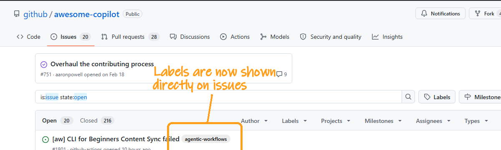
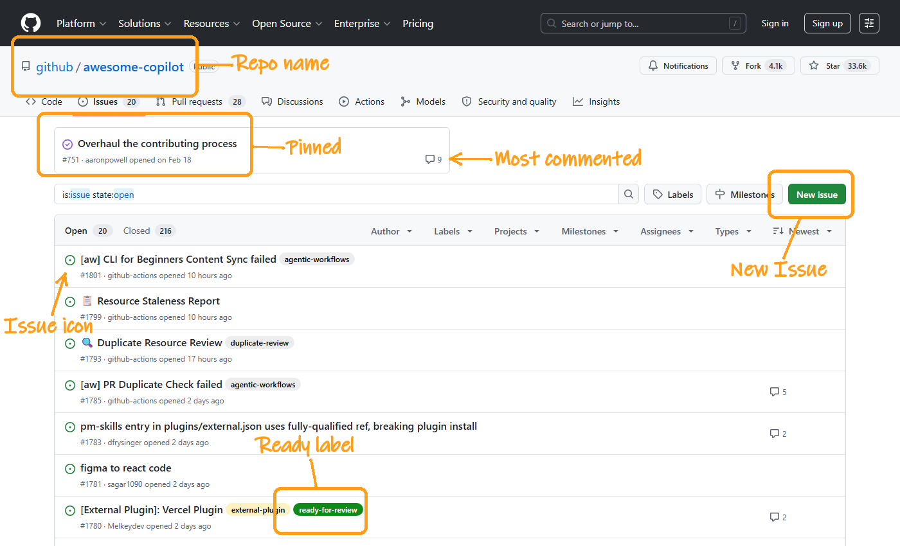
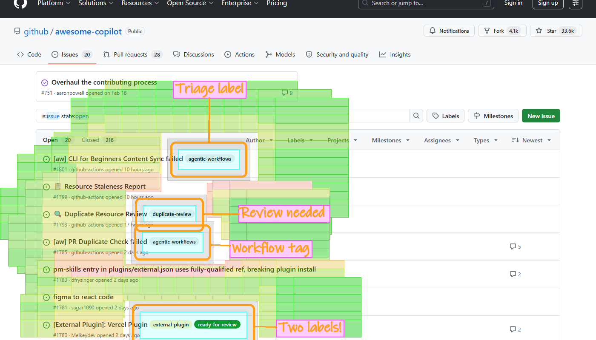

# Visual PR 外掛

當您改變外觀時 — 例如版面、圖表或表單 — PR 說明就應該展示出這些變更。不要用紙上談兵來描述它，而是直接展示出來。一張變更前/變更後的截圖能精準地告訴審查者發生了什麼，他們甚至無需切換分支即可直接查看。

此外掛教導 Copilot 截取您的 Web 應用程式（或任何 UI）的螢幕截圖，並使用標註框 (callouts) 進行說明，然後將其嵌入 PR 說明中。一旦您習慣在每次視覺變更時都附上最新的截圖，回頭使用純文字的 PR 說明將會感覺如同閉著眼睛審查程式碼一樣。

## 演示 🎬

假設現在是 2009 年。您剛新增了在問題 (issues) 上顯示標籤的功能。您最好附上截圖，因為這可是件大事。

以下是使用我們的外掛後，PR 說明呈現的樣子：

> **變更前** — 沒有標籤的問題清單：
>
> 
>
> **變更後** — 標籤直接顯示在每個問題列上：
>
> 

---

## 不僅僅適用於 PR

相同的標註引擎適用於任何螢幕截圖。以下是一個單一指令的範例：

> *"前往 github/awesome-copilot 的 GitHub 問題頁面。截取問題清單，並標註：任何問題圖示、ready-for-review 標籤、儲存庫名稱、釘選的問題、我的頭像、最多評論的問題、以及「新增問題」按鈕。"*

代理捕獲了頁面，識別出所請求的 7 個元素中的 6 個，並將它們全部標註。它準確地報告了第 7 個元素（使用者頭像）不可見，因為頁面是在未驗證的情況下捕獲的 — 沒有產生任何虛構的標註。

### 偵錯模式

每次標註執行都能產生一個偵錯熱點圖 (heatmap)，顯示演算法如何選擇標籤位置 — 對比度評分、排除區域與候選排名：

---

## 包含的技能

| 技能 | 功能 |
|-------|-------------|
| [ui-screenshots](../../skills/ui-screenshots/SKILL.md) | 使用 Playwright + PIL 裁剪工作流程截取 Web UI 截圖 |
| [image-annotations](../../skills/image-annotations/SKILL.md) | 使用標註矩形、箭頭、標籤與色彩編碼高亮來標註任何圖片 |
| [pr-screenshots](../../skills/pr-screenshots/SKILL.md) | 將變更前/變更後的圖片嵌入 PR 說明中（GitHub + Azure DevOps） |
| [screen-recording](../../skills/screen-recording/SKILL.md) | 建立帶有標註且時間可變的動畫 GIF 演示 |

## 使用場景

- **視覺化 PR** — 無需切換分支即可向審查者展示變更內容
- **發佈說明** — 嵌入新功能的 GIF 演示
- **錯誤報告** — 變更前/變更後的截圖證明修復結果
- **技術文件** — 帶有標註與高亮顯示重點區域的螢幕截圖

## 需求

此插件需要一個能檢視圖片的模型 — 該工作流程依賴於查看截圖以找到裁剪座標並驗證標註。此 README 中的演示圖片是使用 **Claude Opus 4.6** 生成的。
