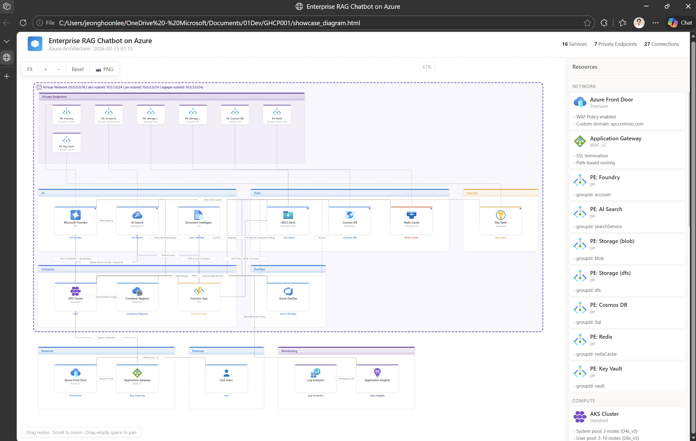

<h1 align="center">Azure 架構自動駕駛 (Azure Architecture Autopilot)</h1>

<p align="center">
  <strong>設計 → 圖表 → Bicep → 部署 - 全部來自自然語言</strong>
</p>

<p align="center">
  
  
  
  
  
</p>

<p align="center">
  <b>Azure 架構自動駕駛</b> 可從自然語言設計 Azure 基礎設施、<br>
  產生互動式圖表、建立模組化 Bicep 範本並進行部署 - 全部透過交談完成。<br>
  它還能掃描現有資源，將其視覺化為架構圖，並即時進行精煉。
</p>

<!-- Hero image: interactive architecture diagram with 605+ Azure icons -->
<p align="center">
  
</p>

<p align="center">
  <em>↑ 自動產生的互動式圖表 — 可拖曳、縮放、點擊查看詳細資訊、匯出為 PNG</em>
</p>

<p align="center">
  
  &nbsp;&nbsp;
  
</p>

<p align="center">
  <em>↑ 從產生的 Bicep 範本部署的真實 Azure 資源</em>
</p>

<p align="center">
  <a href="#-運作原理">運作原理</a> •
  <a href="#-功能">功能</a> •
  <a href="#%EF%B8%8F-前提條件">前提條件</a> •
  <a href="#-用法">用法</a> •
  <a href="#-架構">架構</a>
</p>

---

## 🔄 運作原理

```
路徑 A：「幫我建構一個 Azure 上的 RAG 聊天機器人」
         ↓
  🎨 設計 → 🔧 Bicep → ✅ 檢閱 → 🚀 部署

路徑 B：「分析我目前的 Azure 資源」
         ↓
  🔍 掃描 → 🎨 修改 → 🔧 Bicep → ✅ 檢閱 → 🚀 部署
```

| 階段 | 角色 | 發生了什麼 |
|:-----:|------|--------------|
| **0** | 🔍 掃描器 | 透過 `az` CLI 掃描現有的 Azure 資源 → 自動產生架構圖 |
| **1** | 🎨 顧問 | 透過交談進行互動式設計 — 使用智慧預設值提出針對性問題 |
| **2** | 🔧 產生器 | 產生模組化 Bicep：`main.bicep` + `modules/*.bicep` + `.bicepparam` |
| **3** | ✅ 檢閱者 | 使用 `az bicep build` 進行編譯，檢查安全性與最佳實務 |
| **4** | 🚀 部署者 | `validate` → `what-if` → 預覽圖表 → `create` (強制的 5 步驟順序) |

---

## ✨ 功能

| | 功能 | 說明 |
|---|---------|-------------|
| 📦 | **零相依性** | 內建 605+ 個 Azure 圖示 — 無需 `pip install`，可離線運作 |
| 🎨 | **互動式圖表** | 支援縮放、點擊詳細資訊、PNG 匯出的拖放式 HTML |
| 🔍 | **資源掃描** | 分析現有 Azure 基礎設施 → 自動產生架構圖 |
| 💬 | **自然語言** | *「太慢了」*、*「降低成本」*、*「增加安全性」* → 引導式解決方案 |
| 📊 | **即時驗證** | 從 MS Docs 即時獲取 API 版本、SKU、模型可用性 |
| 🔒 | **預設安全** | 私人端點 (Private Endpoints)、RBAC、受控識別 — 檔案中不含秘密 |
| ⚡ | **平行預載** | 在等待使用者輸入時載入下一階段資訊 |
| 🌐 | **多國語言** | 自動偵測使用者語言 — 支援英文、韓文或任何語言回應 |

---

## ⚙️ 前提條件

| 工具 | 必備 | 安裝 |
|------|:--------:|---------|
| **GitHub Copilot CLI** | ✅ | [安裝指南](https://docs.github.com/copilot/concepts/agents/about-copilot-cli) |
| **Azure CLI** | ✅ | `winget install Microsoft.AzureCLI` / `brew install azure-cli` |
| **Python 3.10+** | ✅ | `winget install Python.Python.3.12` / `brew install python` |

> 無需額外套件 — 圖表引擎已包含在 `scripts/` 中。

### 🤖 建議的模型

| | 模型 | 備註 |
|---|--------|-------|
| 🏆 **最佳** | Claude Opus 4.5 / 4.6 | 所有 5 個階段中最可靠 |
| ✅ **建議** | Claude Sonnet 4.5 / 4.6 | 最佳性價比平衡 |
| ⚠️ **最低** | Claude Sonnet 4, GPT-5.1+ | 在複雜架構中可能會略過步驟 |

---

## 🚀 用法

### 路徑 A — 建構新基礎設施

```
「建構一個包含 Foundry 和 AI Search 的 RAG 聊天機器人」
「使用 Databricks 和 ADLS Gen2 建立資料平台」
「部署具備私人端點的 Fabric + ADF 管線」
「使用 AKS 和 Cosmos DB 設置微服務架構」
```

### 路徑 B — 分析與修改現有資源

```
「分析我目前的 Azure 基礎設施」
「掃描 rg-production 並向我展示架構」
「我的訂閱中有哪些資源？」
```

然後透過交談進行修改：
```
「在此架構中新增 3 個 VM」
「Foundry 端點很慢 — 我能做什麼？」
「降低成本 — 將 AI Search 降級為 Basic」
「為所有服務新增私人端點」
```

### 📂 輸出結構

```
<專案名稱>/
├── 00_arch_current.html         ← 已掃描的架構 (路徑 B)
├── 01_arch_diagram_draft.html   ← 設計圖草稿
├── 02_arch_diagram_preview.html ← What-if 預覽圖
├── 03_arch_diagram_result.html  ← 部署結果圖
├── main.bicep                   ← 協調 (Orchestration)
├── main.bicepparam              ← 參數值
└── modules/
    └── *.bicep                  ← 各服務模組
```

---

## 📁 架構

```
SKILL.md                            ← 輕量化路由器 (~170 行)
│
├── scripts/                         ← 內建圖表引擎
│   ├── generator.py                 ← 互動式 HTML 產生器
│   ├── icons.py                     ← 605+ 個 Azure 圖示 (Base64 SVG)
│   └── cli.py                       ← CLI 進入點
│
└── references/                      ← 各階段指令 + 模式
    ├── phase0-scanner.md            ← 🔍 資源掃描
    ├── phase1-advisor.md            ← 🎨 架構設計
    ├── bicep-generator.md           ← 🔧 Bicep 產生
    ├── bicep-reviewer.md            ← ✅ 程式碼檢閱
    ├── phase4-deployer.md           ← 🚀 部署管線
    ├── service-gotchas.md           ← 必要屬性與 PE 映射
    ├── azure-common-patterns.md     ← 安全性與命名模式
    ├── azure-dynamic-sources.md     ← MS Docs URL 註冊表
    ├── architecture-guidance-sources.md
    └── ai-data.md                   ← AI/資料服務網域包
```

> **自給自足** — `SKILL.md` 是一個輕量化路由器。所有階段邏輯都位於 `references/` 中。圖表引擎嵌入在 `scripts/` 中，無外部相依性。

---

## 📊 支援的服務 (70+ 種類型)

支援所有 Azure 服務。AI/資料服務擁有最佳化的範本；其他服務則自動從 MS Docs 查閱。

**關鍵類型：** `ai_foundry` · `openai` · `ai_search` · `storage` · `adls` · `keyvault` · `fabric` · `databricks` · `aks` · `vm` · `app_service` · `function_app` · `cosmos_db` · `sql_server` · `postgresql` · `mysql` · `synapse` · `adf` · `apim` · `service_bus` · `logic_apps` · `event_grid` · `event_hub` · `container_apps` · `app_insights` · `log_analytics` · `firewall` · `front_door` · `load_balancer` · `expressroute` · `sentinel` · `redis` · `iot_hub` · `digital_twins` · `signalr` · `acr` · `bastion` · `vpn_gateway` · `data_explorer` · `document_intelligence` ...


---

## 📄 授權

MIT © [Jeonghoon Lee](https://github.com/whoniiii)
