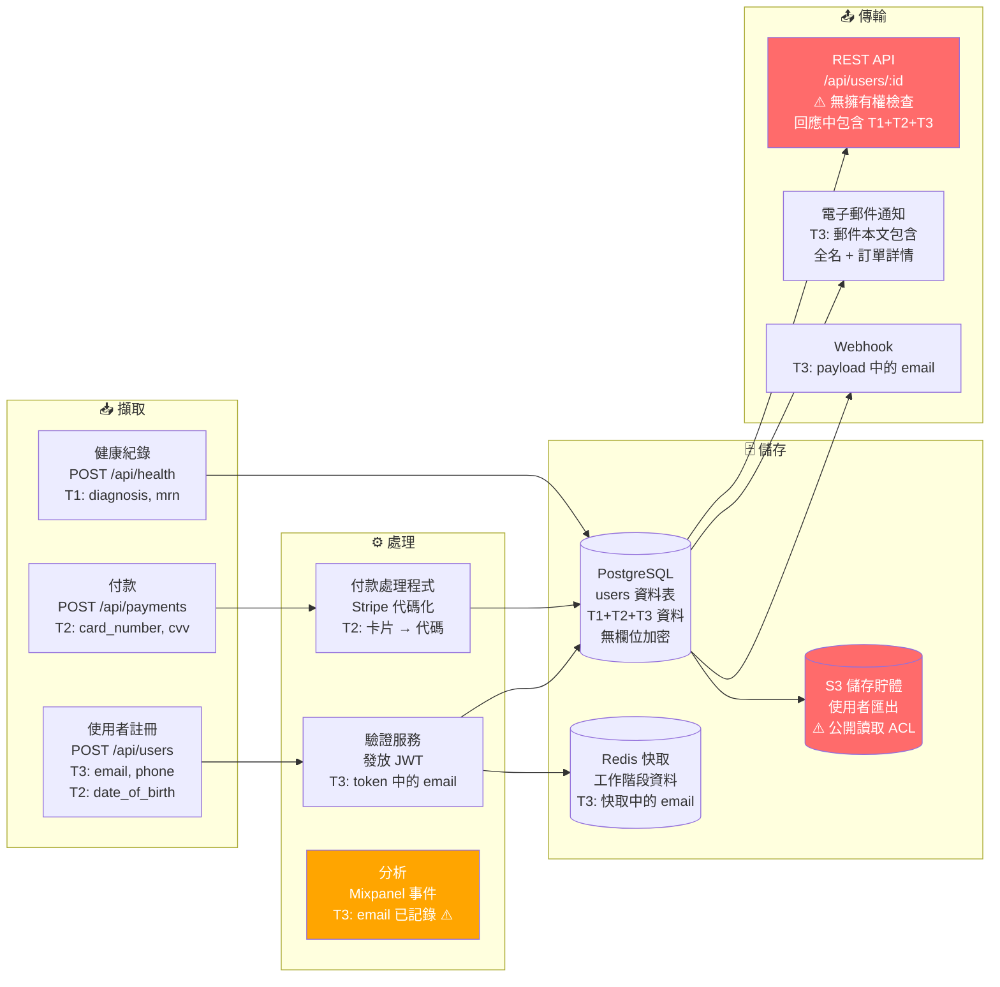

# 影響範圍報告格式

使用此範本產生完整的資料外洩影響範圍 (Data Breach Blast Radius) 報告。填寫每個章節 — 請勿跳過任何內容。

---

## 完整報告範本

````markdown
# 💥 資料外洩影響範圍報告

**儲存庫：** [分析的儲存庫名稱或路徑]  
**分析日期：** [ISO 8601 日期]  
**範圍：** [完整儲存庫 / 特定路徑]  
**偵測到的語言 / 框架：** [清單]  
**分析者：** GitHub Copilot — data-breach-blast-radius 技能  

---

## 執行摘要

[2–3 段簡單易懂的內容。無技術術語。假設讀者是執行長、資訊安全長或董事會成員，他們會問：「這會有多糟？」

第 1 段：此系統持有什麼資料，大約有多少人受影響？
第 2 段：發現的最危險的單一暴露向量是什麼？如果今天被利用會發生什麼事？
第 3 段：估計的財務和監管影響是什麼？最重要且需要優先修復的是什麼？]

---

## 敏感資料清單

在程式碼中發現的所有個人、健康、財務和憑證資料：

| # | 欄位名稱 | 來源位置 | 資料層級 | 類別 | 已加密？ | 已記錄？ | 外部暴露？ |
|---|-----------|----------------|-----------|----------|-----------|---------|-------------------|
| 1 | `email` | `models/user.py:14` | T3 — 高 | 聯絡資訊 | ❌ 否 | ⚠️ 是 | ✅ API 回應 |
| 2 | `ssn` | `models/employee.py:28` | T1 — 災難性 | 政府 ID | ❌ 否 | ❌ 否 | ❌ 否 |
| 3 | `card_number` | `models/payment.py:9` | T2 — 關鍵 | PCI-DSS | ⚠️ 部分 | ❌ 否 | ❌ 否 |
| ... | ... | ... | ... | ... | ... | ... | ... |

**摘要：**
- 第 1 級 (災難性) 欄位：[N]
- 第 2 級 (關鍵) 欄位：[N]
- 第 3 級 (高) 欄位：[N]
- 第 4 級 (提升) 欄位：[N]

---

## 資料流向圖

敏感資料如何在系統中移動。由左至右閱讀：擷取 → 處理 → 儲存 → 傳輸。



---

## 首要暴露向量

按影響範圍評分排序（最高者優先）：

### 🔴 向量 1：[標題] — BRS：[分數]/100

**位置：** `[檔案路徑]:[行號]`  
**類型：** [IDOR / 未驗證的端點 / 公開儲存空間 / 紀錄外洩 / 過度擷取的 API / 等]  
**暴露的資料：** [會被暴露的 T1/T2/T3 欄位]  
**攻擊利用：** [1–2 句 — 攻擊者會如何利用此項]  
**有風險的紀錄：** [數量或估計值]  
**觸發的司法管轄區：** [GDPR / CCPA / HIPAA / 等]

```[language]
// 有漏洞的程式碼片段（確切位置）
[程式碼]
```

**影響範圍評分細目：**
- 資料層級：T[N] → 權重 [W]
- 暴露可能性：[E] ([標籤])
- 有風險的母體：[N] 筆紀錄 → 規模 [P]
- 完整性：[因素] ([標籤])
- 背景乘數：×[M] ([理由])
- **BRS：[計算得分]/100**

---

### 🔴 向量 2：[標題] — BRS：[分數]/100

[重複結構]

---

### 🟠 向量 3：[標題] — BRS：[分數]/100

[重複結構]

---

### 🟠 向量 4：[標題] — BRS：[分數]/100

[重複結構]

---

### 🟡 向量 5：[標題] — BRS：[分數]/100

[重複結構]

---

## 監管影響範圍

### 觸發的司法管轄區

| 法規 | 是否觸發？ | 觸發證據 | 通知期限 |
|-----------|-----------|-----------------|----------------------|
| GDPR | [是/否/未知] | [例如：歐元貨幣、歐盟雲端區域] | 72 小時 |
| CCPA | [是/否/未知] | [例如：加州使用者、美國網域] | 及時 |
| HIPAA | [是/否/未知] | [例如：發現 PHI 欄位、FHIR 端點] | 60 天 |
| LGPD | [是/否/未知] | [例如：巴西幣、CPF 欄位] | 2 個工作天 |
| 新加坡 PDPA | [是/否/未知] | [例如：新加坡幣、+65 電話模式] | 3 個日曆天 |
| PCI-DSS | [是/否/未知] | [例如：發現 card_number 欄位] | 立即 |

---

## 財務影響評估

> 這些僅為風險規畫估計值。請諮詢法律顧問以瞭解實際的監管風險。

### 最大同時暴露量
- **有風險的紀錄總數 (最壞情況)：** [數量]
- **第 1 級紀錄 (災難性資料)：** [數量]
- **估計受影響的個人：** [數量]
- **活躍的監管司法管轄區：** [清單]

### 財務影響範圍

| 情境 | 估計成本 | 關鍵假設 |
|---------|---------------|----------------|
| **最低** (快速反應、少量紀錄、監管結果配合良好) | $[X] | [假設] |
| **可能** (產業平均反應時間、適度的監管行動) | $[X] | [假設] |
| **最高** (偵測緩慢、最高額罰款、集體訴訟) | $[X] | [假設] |

### 細目 (可能的情境)

| 成本類別 | 估計值 |
|--------------|---------|
| 偵測與圍堵 | $[X] |
| 外洩後反應 | $[X] |
| 法律與鑑識 | $[X] |
| 外洩通知與監控 | $[X] |
| 監管罰款 ([司法管轄區]) | $[X] |
| 名譽/業務影響 | $[X] |
| **估計總成本** | **$[X]** |

**使用的成本基準：** IBM 2024 年資料外洩成本報告（全球平均 488 萬美元，每筆紀錄平均 165 美元） — 請至 ibm.com/reports/data-breach 驗證最新數據

---

## 強化藍圖

按 `(影響範圍減少率 × 嚴重性) / 努力` 排序：

### 🔴 P0 — 立即修復 (每個項目 < 1 天)

| # | 行動 | 檔案 / 位置 | 影響範圍減少率 | 努力 | 嚴重性 |
|---|--------|----------------|----------------------|--------|---------|
| 1 | [修復 /api/users/:id 的 IDOR — 增加擁有權檢查] | `routes/users.ts:45` | 此向量減少 85% | ⚡ 低 | 關鍵 |
| 2 | [從 API 回應 DTO 移除 SSN] | `dtos/employee.dto.ts:22` | SSN 暴露減少 90% | ⚡ 低 | 關鍵 |
| 3 | [封鎖 S3 儲存貯體上的公開讀取 ACL] | `infra/storage.tf:14` | S3 暴露減少 100% | ⚡ 低 | 高 |

---

### 🟠 P1 — 本週修復

| # | 行動 | 檔案 / 位置 | 影響範圍減少率 | 努力 | 嚴重性 |
|---|--------|----------------|----------------------|--------|---------|
| 4 | [使用 KMS 加密 SSN 欄位] | `models/employee.py:28` | SSN 欄位減少 80% | 🔧 中 | 高 |
| 5 | [從記錄陳述式移除 email (7 處)] | `services/auth.py:66,89,121...` | 記錄向量減少 60% | 🔧 中 | 高 |
| 6 | [卡片資料代碼化 — 遷移至 Stripe Elements] | `services/payment.py` | 卡片資料減少 95% | 🔧 中 | 關鍵 |

---

### 🟡 P2 — 本次衝刺修復

| # | 行動 | 影響範圍減少率 | 努力 | 嚴重性 |
|---|--------|----------------------|--------|---------|
| 7 | [為 /api/users/search 增加頻率限制] | 批量擷取減少 50% | ⚡ 低 | 中 |
| 8 | [為 T1/T2 讀取增加資料存取稽核記錄] | 偵測時間縮短 60% | 🔧 中 | 高 |
| 9 | [為使用者查詢增加欄位投影 (從 SELECT 移除未使用的欄位)] | 過度擷取減少 40% | ⚡ 低 | 中 |

---

### ⚪ P3 — 本季修復

| # | 行動 | 影響範圍減少率 | 努力 | 嚴重性 |
|---|--------|----------------------|--------|---------|
| 10 | [實作資料保留原則 + 自動刪除作業] | 陳舊資料暴露減少 30% | 🏗️ 高 | 中 |
| 11 | [將分析使用者 ID 匿名化 (Pseudonymize)] | 分析資料減少 70% | 🔧 中 | 中 |
| 12 | [將分析儲存空間與生產 PII 資料庫分離] | 架構性減少 60% | 🏗️ 高 | 低 |

---

## 分析假設

記錄此次分析期間所做的所有假設（透明度至關重要）：

| 假設 | 使用的值 | 依據 |
|-----------|-------|-----------|
| 使用者人數估算 | [X 位使用者] | [發現的訊號或保守預設值] |
| 用於罰款計算的年營收估算 | [未知 / $X 範圍] | [訊號或未發現] |
| 地理分佈 | [假設全球 / 可能有歐盟使用者] | [發現的貨幣訊號] |
| 醫療保健背景 | [假設 / 不適用] | [發現 / 未發現 PHI 欄位] |

---

## 掃描內容

- **分析的檔案：** [列出關鍵檔案或註明「儲存庫中的所有檔案」]
- **資料模型檔案：** [列出結構描述/模型檔案]
- **API 層：** [列出控制器/路由檔案]
- **設定/基礎設施：** [列出 .env, Terraform, CI/CD 檔案]
- **記錄/監控：** [列出記錄設定檔案]
- **測試資料：** [註明測試固定裝置 (fixtures) 是否包含真實 PII]

---

*此報告由 GitHub Copilot 的 [data-breach-blast-radius](https://github.com/github/awesome-copilot/tree/main/skills/data-breach-blast-radius) 技能產生。*  
*僅供風險規畫參考。請諮詢合格的法律顧問和資安專家以獲取實際的法律指引。*
````

---

## Mermaid 圖表慣例

在資料流向圖中使用以下慣例：

```
# 節點顏色 (使用樣式宣告)：
🔴 fill:#ff6b6b,color:#fff  → 公開/未經身份驗證的暴露 (關鍵)
🟠 fill:#ffa500,color:#fff  → 需要身份驗證但控制薄弱 (高)
🟡 fill:#ffd700,color:#000  → 內部但過於寬泛的存取權限 (中)
🟢 fill:#51cf66,color:#fff  → 已妥善保護 (良好)

# 節點標籤應包含：
- 行動名稱
- HTTP 方法 + 路徑 (用於 API 節點)
- 存在的資料層級 (T1, T2, T3)
- ⚠️ 如果存在問題，則顯示警告表情符號

# 子圖：
- 擷取 (📥)
- 處理 (⚙️)
- 儲存 (🗄️)
- 傳輸 (📤)
```

---

## 嚴重性圖示

| 符號 | 嚴重性 | BRS 範圍 |
|--------|---------|-----------|
| 🔴 | 關鍵 | 76–100 |
| 🟠 | 高 | 51–75 |
| 🟡 | 中 | 26–50 |
| 🔵 | 低 | 0–25 |
| ✅ | 安全 | 已實施控制 |
| ⚠️ | 警告 | 部分控制 |
| ❌ | 易受攻擊 | 無控制 |
