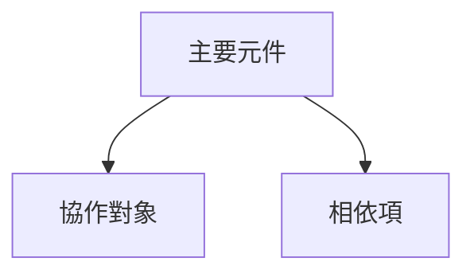

# [元件名稱] 文件

[簡潔的介紹，說明元件在系統中的目的與角色。]

## 1. 元件概觀

### 目的/職責

- OVR-001：陳述元件的主要職責
- OVR-002：定義範圍，包括包含與排除的職責
- OVR-003：描述系統上下文與主要關係

## 2. 架構章節

- ARC-001：記錄使用的設計模式
- ARC-002：列出內部與外部相依項及其目的
- ARC-003：描述元件互動與關係
- ARC-004：包含視覺圖表，以便釐清結構或行為
- ARC-005：提供 Mermaid 圖表，顯示結構、關係與相依性

### 元件結構與相依性圖表

顯示目前的：

- 元件結構
- 內部相依項
- 外部相依項
- 資料流
- 繼承與組合關係



## 3. 介面文件

- INT-001：記錄公開介面與使用模式
- INT-002：提供方法或屬性參考表
- INT-003：涵蓋事件、回呼 (callback) 或通知機制 (若適用)

| 方法/屬性 | 目的 | 參數 | 傳回型別 | 使用備註 |
|-----------------|---------|------------|-------------|-------------|
| [名稱] | [目的] | [參數] | [型別] | [備註] |

## 4. 實作細節

- IMP-001：描述主要實作類別與職責
- IMP-002：擷取設定要求與初始化模式
- IMP-003：摘要關鍵演算法或業務邏輯
- IMP-004：註記效能特性與瓶頸

## 5. 使用範例

### 基礎用法

```text
[與元件語言和 API 一致的基礎用法範例]
```

### 進階用法

```text
[與目前實作一致的進階設定或編排範例]
```

- USE-001：提供基礎用法範例
- USE-002：顯示進階設定模式
- USE-003：記錄最佳實務與建議模式

## 6. 品質屬性

- QUA-001：安全性
- QUA-002：效能
- QUA-003：可靠性
- QUA-004：可維護性
- QUA-005：延展性

## 7. 參考資訊

- REF-001：列出相依項及其版本與目的 (若可用)
- REF-002：記錄設定選項
- REF-003：提供測試指南與 Mock 設定備註
- REF-004：擷取疑難排解備註與常見問題
- REF-005：連結相關文件
- REF-006：新增變更歷史記錄或遷移備註 (當相關時)
