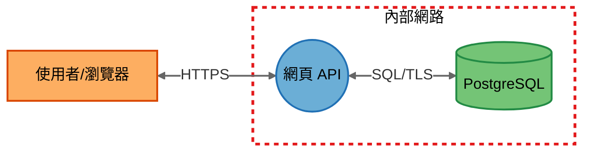
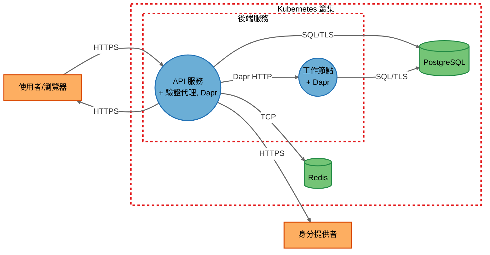
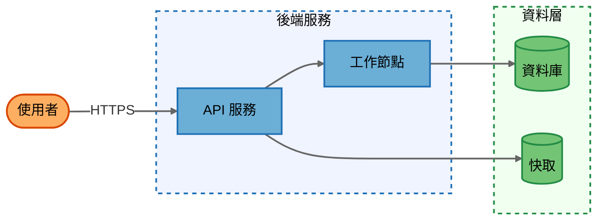
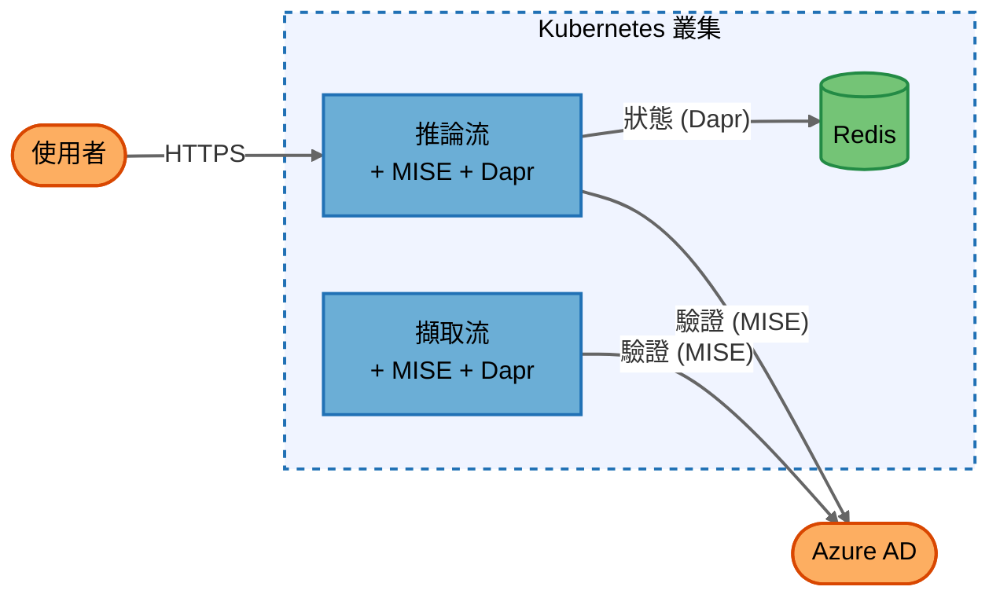
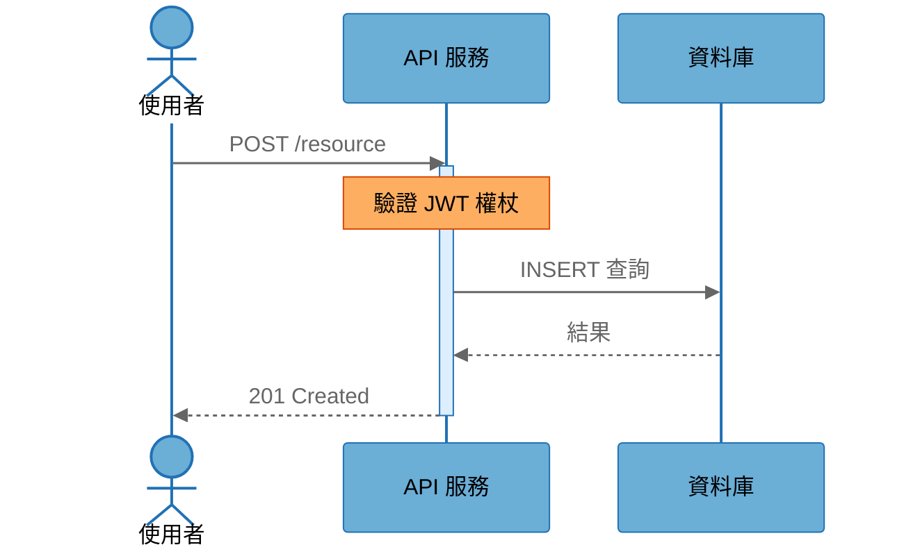

# 圖表規範 — 用於威脅模型與架構的 Mermaid 圖表

本檔案包含在威脅模型報告中建立 Mermaid 圖表的所有規則。它是自成一體的 — 建立正確圖表所需的所有資訊都在這裡。

---

## ⛔ 關鍵規則 — 在繪製任何圖表前必讀

這些是常被違反的規則。請先閱讀這些規則，並在完成每張圖表後重新檢查。

### 規則 1：Kubernetes Sidecar 共用位置 (強制執行)

當目標系統執行於 Kubernetes 時，**共用同一個 Pod 的容器必須表示在一起** — 絕不能作為獨立的元件。

**正確做法 — 在主容器的標籤中標註：**
```
InferencingFlow(("Inferencing Flow<br/>+ MISE, Dapr")):::process
IngestionFlow(("Ingestion Flow<br/>+ MISE, Dapr")):::process
VectorDbApi(("VectorDB API<br/>+ Dapr")):::process
```

**錯誤做法 — 絕不要建立獨立的 Sidecar 節點：**
```
❌ MISE(("MISE Sidecar")):::process
❌ DaprSidecar(("Dapr Sidecar")):::process
❌ InferencingFlow -->|"localhost"| MISE
```

**原因**：Sidecar (Dapr, MISE/驗證代理, Envoy, Istio 代理, 記錄收集器) 與其主容器共用 Pod 的網路命名空間、生命週期和安全上下文。它們不是獨立的服務。

**此規則適用於所有圖表類型**：架構圖、威脅模型圖、摘要圖。

### 規則 2：無 Pod 內流量 (強制執行)

**不要繪製主容器與其 Sidecar 之間的資料流。** 這些流量已透過共用位置的標註隱含表達。

```
❌ InferencingFlow -->|"localhost:3500"| DaprSidecar
❌ InferencingFlow -->|"localhost:8080"| MISE
```

Pod 內通訊發生在 localhost — 它沒有安全邊界，不應出現在圖表中。

### 規則 3：跨邊界 Sidecar 流量源自宿主容器

當 Sidecar 進行跨越信任邊界的呼叫時（例如：MISE → Azure AD, Dapr → Redis），請**從宿主容器節點**繪製箭頭 — 絕不要從獨立的 Sidecar 節點繪製。

```
✅ InferencingFlow -->|"HTTPS (MISE auth)"| AzureAD
✅ IngestionAPI -->|"HTTPS (MISE auth)"| AzureAD
✅ InferencingFlow -->|"TCP (Dapr)"| Redis

❌ MISESidecar -->|"HTTPS"| AzureAD
❌ DaprSidecar -->|"TCP"| Redis
```

如果多個 Pod 具有相同的 Sidecar 呼叫相同的外部目標，請為每個宿主容器繪製一個箭頭。指向同一個目標的多個箭頭是正確的。

### 規則 4：元件表 — 無獨立 Sidecar 資料列

不要為 Sidecar 新增獨立的元件表資料列。請在宿主容器的說明欄位中描述它們：

```
✅ | Inferencing Flow | Process | API service + MISE auth proxy + Dapr sidecar | Backend Services |
❌ | MISE Sidecar     | Process | Auth proxy for Inferencing Flow              | Backend Services |
```

如果某個 Sidecar 類別具有自己的威脅面（例如：MISE 驗證繞過），它在 STRIDE 分析中會獲得一個 `## Component` 章節 — 但它仍然不是一個獨立的圖表節點。

---

## 渲染前檢查清單 (在最終確定前驗證)

在繪製任何圖表後，請驗證：

- [ ] **每個 K8s 服務節點都標註了 Sidecar？** — 每個 Pod 的程序節點都為所有共用位置的容器包含 `<br/>+ SidecarName`
- [ ] **零獨立 Sidecar 節點？** — 搜尋圖表中是否有名稱為 `MISE`, `Dapr`, `Envoy`, `Istio`, `Sidecar` 的節點 — 這些絕不能作為獨立節點存在
- [ ] **零 Pod 內 localhost 流量？** — localhost 上容器與其 Sidecar 之間沒有箭頭
- [ ] **跨邊界 Sidecar 流量源自宿主？** — 所有指向外部目標 (Azure AD, Redis 等) 的箭頭都源自主容器節點
- [ ] **背景強制為白色？** — `%%{init}%%` 區塊包含 `'background': '#ffffff'`
- [ ] **所有 classDef 都包含 `color:#000000`？** — 每個元件上都有黑色文字
- [ ] **存在 `linkStyle default`？** — `stroke:#666666,stroke-width:2px`
- [ ] **所有標籤都加引號？** — `["Name"]`, `(("Name"))`, `-->|"Label"|`
- [ ] **Subgraph/end 成對匹配？** — 每個 `subgraph` 都有一個對應的 `end`
- [ ] **套用了信任邊界樣式？** — `stroke:#e31a1c,stroke-width:3px,stroke-dasharray: 5 5`

---

## 調色盤

> **⛔ 重要：僅使用這些精確的十六進位程式碼。不要自行創造顏色、使用 Chakra UI 顏色 (#4299E1, #48BB78, #E53E3E)、Tailwind 顏色或任何其他調色盤。以下顏色來自 ColorBrewer 定性調色盤，旨在確保色盲易讀性。請逐字複製本檔案中的 classDef 資料列。**

這些顏色共用於所有 Mermaid 圖表。顏色來自 ColorBrewer 定性調色盤 — 專為色盲易讀性而設計。

| 顏色角色 | 填滿 (Fill) | 邊框 (Stroke) | 用於 |
|------------|------|--------|----------|
| 藍色 | `#6baed6` | `#2171b5` | 服務/程序 |
| 琥珀色 | `#fdae61` | `#d94701` | 外部執行者 |
| 綠色 | `#74c476` | `#238b45` | 資料儲存 |
| 紅色 | 無 | `#e31a1c` | 信任邊界（僅限威脅模型圖） |
| 深灰色 | 無 | `#666666` | 箭頭/連結 |
| 文字 | 均為：`color:#000000` | | 每個元件上均為黑色文字 |

### 設計原理

| 元件 | 填滿 (Fill) | 邊框 (Stroke) | 文字 | 原因 |
|---------|------|--------|------|-----|
| 程序 (Process) | `#6baed6` | `#2171b5` | `#000000` | 中藍色 — 在兩種主題下都清晰可見 |
| 外部執行者 | `#fdae61` | `#d94701` | `#000000` | 暖琥珀色 — 與藍色/綠色區分開來 |
| 資料儲存 | `#74c476` | `#238b45` | `#000000` | 中綠色 — 對於儲存元件很自然 |
| 信任邊界 | 無 | `#e31a1c` | 無 | 紅色虛線 — 3px 以利辨識 |
| 箭頭/連結 | 無 | `#666666` | 無 | 白色背景上的深灰色 |
| 背景 | `#ffffff` | 無 | 無 | 強制白色，確保在深色主題下的安全渲染 |

---

## 強制白色背景 (要求)

每個 Mermaid 圖表 — 流程圖 (Flowchart) 與時序圖 (Sequence Diagram) — 必須包含一個強制白色背景的 `%%{init}%%` 區塊。這可確保圖表在深色主題中正確顯示。

> **⛔ 重要：不要將 `primaryColor`, `secondaryColor`, `tertiaryColor` 或任何自訂顏色金鑰新增到 themeVariables。init 區塊僅控制背景和線條顏色。所有元件顏色都來自 classDef 資料列 — 絕不來自 themeVariables。如果您在 themeVariables 中新增顏色覆蓋，它們將會破壞 classDef 調色盤。**

### 流程圖 Init 區塊

新增為每個 `.mmd` 檔案或 ` ```mermaid ` 流程圖的**第一行**：

```
%%{init: {'theme': 'base', 'themeVariables': { 'background': '#ffffff', 'primaryColor': '#ffffff', 'lineColor': '#666666' }}}%%
```

**以上是流程圖唯一允許的 INIT 區塊。** 請勿修改，請勿新增金鑰，請逐字複製。

### 箭頭 / 連結預設樣式

新增於 classDef 資料列之後：

```
linkStyle default stroke:#666666,stroke-width:2px
```

### 時序圖 Init 區塊

時序圖無法使用 `classDef`。請使用此 init 區塊：

```
%%{init: {'theme': 'base', 'themeVariables': {
  'background': '#ffffff',
  'actorBkg': '#6baed6', 'actorBorder': '#2171b5', 'actorTextColor': '#000000',
  'signalColor': '#666666', 'signalTextColor': '#666666',
  'noteBkgColor': '#fdae61', 'noteBorderColor': '#d94701', 'noteTextColor': '#000000',
  'activationBkgColor': '#ddeeff', 'activationBorderColor': '#2171b5',
  'sequenceNumberColor': '#767676',
  'labelBoxBkgColor': '#f0f0f0', 'labelBoxBorderColor': '#666666', 'labelTextColor': '#000000',
  'loopTextColor': '#000000'
}}}%%
```

---

## 圖表類型：威脅模型 (DFD)

用於：`1-threatmodel.md`, `1.1-threatmodel.mmd`, `1.2-threatmodel-summary.mmd`

### `.mmd` 檔案格式 — 重要

`.mmd` 檔案僅包含 **Mermaid 原始程式碼** — 無 markdown，無程式碼區塊。檔案必須從第 1 行開始：
```
%%{init: {'theme': 'base', 'themeVariables': { 'background': '#ffffff', 'primaryColor': '#ffffff', 'lineColor': '#666666' }}}%%
```
第 2 行接著寫 `flowchart LR`。絕不使用 `flowchart TB`。

**錯誤**：檔案以 ` ```plaintext ` 或 ` ```mermaid ` 開始 — 這些是程式碼區塊，會損壞 `.mmd` 檔案。

### ClassDef 與形狀

```
classDef process fill:#6baed6,stroke:#2171b5,stroke-width:2px,color:#000000
classDef external fill:#fdae61,stroke:#d94701,stroke-width:2px,color:#000000
classDef datastore fill:#74c476,stroke:#238b45,stroke-width:2px,color:#000000
```

| 元件類型 | 形狀語法 | 範例 |
|-------------|-------------|---------|
| 程序 (Process) | `(("Name"))` 圓形 | `WebApi(("Web API")):::process` |
| 外部執行者 | `["Name"]` 矩形 | `User["User/Browser"]:::external` |
| 資料儲存 | `[("Name")]` 圓柱體 | `Database[("PostgreSQL")]:::datastore` |

### 信任邊界樣式

```
subgraph BoundaryId["顯示名稱"]
    %% 內部的元件
end
style BoundaryId fill:none,stroke:#e31a1c,stroke-width:3px,stroke-dasharray: 5 5
```

### 流程標籤

```
單向：  A -->|"標籤"| B
雙向：  A <-->|"標籤"| B
```

### 資料流 ID (Data Flow IDs)

- 詳細流程：`DF01`, `DF02`, `DF03`...
- 摘要流程：`SDF01`, `SDF02`, `SDF03`...

### 完整 DFD 範本



### Kubernetes DFD 範本（包含 Sidecar）



**關鍵點：**
- 驗證代理 (AuthProxy) 與 Dapr 被標註在宿主節點上 (`+ 驗證代理, Dapr`)，而不是作為獨立節點
- `ApiService -->|"HTTPS"| IdP` = 驗證代理的跨邊界呼叫，從宿主容器繪製
- `ApiService -->|"TCP"| Redis` = Dapr 的跨邊界呼叫，從宿主容器繪製
- 未繪製 Pod 內流量

---

## 圖表類型：架構圖

僅用於：`0.1-architecture.md`

### ClassDef 與形狀

```
classDef service fill:#6baed6,stroke:#2171b5,stroke-width:2px,color:#000000
classDef external fill:#fdae61,stroke:#d94701,stroke-width:2px,color:#000000
classDef datastore fill:#74c476,stroke:#238b45,stroke-width:2px,color:#000000
```

| 元件類型 | 形狀語法 | 備註 |
|-------------|-------------|-------|
| 服務/程序 | `["Name"]` 或 `(["Name"])` | 圓角矩形或體育場形 |
| 外部執行者 | `(["Name"])` 搭配 `external` 類別 | 琥珀色用於區分 |
| 資料儲存 | `[("Name")]` 圓柱體 | 與 DFD 相同 |
| **不要**使用圓形 `(("Name"))` | | 保留給 DFD 威脅模型圖 |

### 分層分組樣式（非信任邊界）

```
style LayerId fill:#f0f4ff,stroke:#2171b5,stroke-width:2px,stroke-dasharray: 5 5
```

層級顏色：
- 後端 (Backend)：`fill:#f0f4ff,stroke:#2171b5` (淡藍色)
- 資料 (Data)：`fill:#f0fff0,stroke:#238b45` (淡綠色)
- 外部 (External)：`fill:#fff8f0,stroke:#d94701` (淡琥珀色)
- 基礎架構 (Infrastructure)：`fill:#f5f5f5,stroke:#666666` (淡灰色)

### 流程規範

- 標籤說明**通訊內容**：`"使用者查詢"`, `"驗證權杖"`, `"記錄資料"`
- 通訊協定可放在括號內：`"查詢 (gRPC)"`
- 箭頭比 DFD 簡單 — 使用 `-->`，不要求雙向流程

### 架構圖中的 Kubernetes Pod

顯示包含完整容器組合的 Pod：
```
inf["推論流<br/>+ MISE + Dapr"]:::service
ing["擷取流<br/>+ MISE + Dapr"]:::service
```

### 與 DFD 的關鍵差異

架構圖顯示**系統的功能**（邏輯元件與互動）。威脅模型 DFD 顯示**可能被攻擊的地方**（信任邊界、帶有協定的資料流、元件類型）。它們共用許多元件，但服務於不同的目的。

### 完整架構圖範本



### Kubernetes 架構範本



---

## 時序圖規則

用於：`0.1-architecture.md` 頂部案例

- **前 3 個案例必須**各包含一個 Mermaid `sequenceDiagram`
- 案例 4-5 可選用
- 在每個圖表頂部使用上方的**時序圖 Init 區塊**
- 使用與「關鍵元件表」匹配的 `participant` 別名
- 顯示啟動 (`activate`/`deactivate`) 用於請求-回應模式
- 包含 `Note` 區塊用於安全相關步驟（例如：「驗證 JWT 權杖」）
- 保持圖表聚焦 — 核心工作流，而非每個錯誤路徑

### 完整時序圖範例



---

## 摘要圖規則

用於：`1.2-threatmodel-summary.mmd`（僅當詳細圖表超過 15 個元件或 4 個信任邊界時生成）

1. **必須保留所有信任邊界** — 絕不合併或省略
2. **僅合併非以下類型的元件**：進入點、核心流程元件、安全關鍵服務、主要資料儲存
3. **可合併的候選者**：支援基礎架構、次要快取、位於相同信任層級的多個外部元件
4. **合併元件的標籤必須列出內容**：
   ```
   DataLayer[("資料層<br/>(UserDB, OrderDB, Redis)")]
   SupportServices(("支援服務<br/>(記錄, 監控)"))
   ```
5. 使用 `SDF` 前綴作為摘要資料流：`SDF01`, `SDF02`, ...
6. 在 `1-threatmodel.md` 中包含映射表：
   ```
   | 摘要元件 | 包含內容 | 摘要流程 | 映射到詳細流程 |
   ```

---

## 命名規範

| 項目 | 規範 | 範例 |
|------|-----------|---------|
| 元件 ID | PascalCase, 無空格 | `WebApi`, `UserDb` |
| 顯示名稱 | 引號內的易讀名稱 | `"網頁 API"`, `"使用者資料庫"` |
| 流程標籤 | 引號內的協定或操作 | `"HTTPS"`, `"SQL"`, `"gRPC"` |
| 流程 ID | 唯一的短識別碼 | `DF01`, `DF02` |
| 邊界 ID | PascalCase | `InternalNetwork`, `PublicDMZ` |

**重要：始終為 Mermaid 圖表中的所有文字加上引號：**
- 元件標籤：`["名稱"]`, `(("名稱"))`, `[("名稱")]`
- 流程標籤：`-->|"標籤"|`
- Subgraph 標題：`subgraph ID["標題"]`

---

## 快速參考 - 形狀

```
外部執行者：  ["名稱"]     → 矩形
程序：        (("名稱"))   → 圓形（雙括號）
資料儲存：    [("名稱")]   → 圓柱體
```

## 快速參考 - 流程

```
單向：  A -->|"標籤"| B
雙向：  A <-->|"標籤"| B
```

## 快速參考 - 邊界

```
subgraph BoundaryId["顯示名稱"]
    %% 內部的元件
end
style BoundaryId fill:none,stroke:#e31a1c,stroke-width:3px,stroke-dasharray: 5 5
```

---

## STRIDE 分析 — Sidecar 的影響

雖然 Sidecar 並非獨立的圖表節點，但它們**確實**會出現在 STRIDE 分析中：

- 具有獨特威脅面的 Sidecar (例如 MISE 驗證繞過、Dapr mTLS) 在 `2-stride-analysis.md` 中有其專屬的 `## Component` 章節
- 元件標題註明了它們共用位置的 Pod
- 與 Pod 內通訊相關的威脅（localhost 繞過、共用命名空間）放在**主容器**的元件章節中
- STRIDE 範本中的 **Pod 共用位置 (Pod Co-location)** 行：列出共用的 Sidecar（例如：「MISE Sidecar, Dapr Sidecar」）
